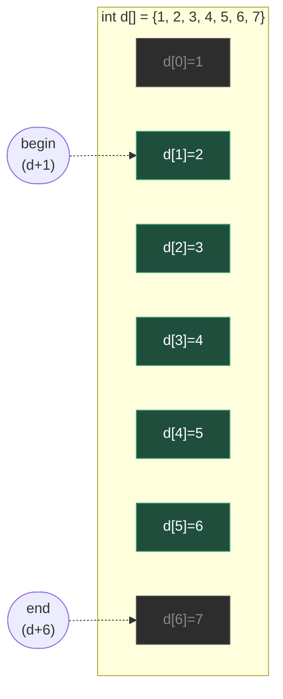
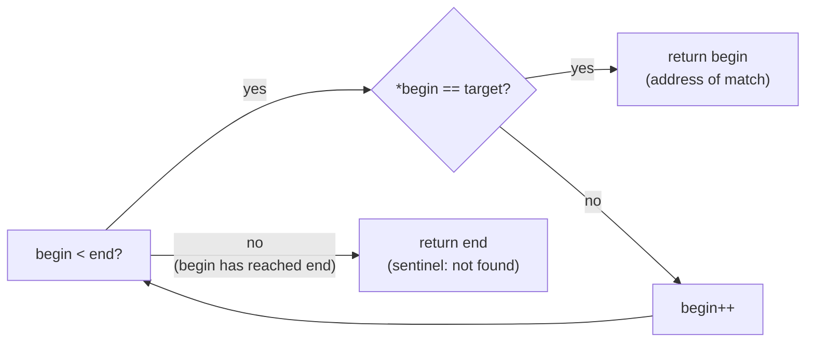

# Pointer Practice: Arrays and Structs

**Date:** 2026-10-03

**Language:** C

**Source:** boot.dev

**Concepts:** pointer traversal (`p++`, `*p`) · half-open ranges `[begin, end)` · pointer-as-iterator vs array indexing · pointer subtraction (`end - begin`) · struct pointers and `->` · sentinel-return pattern (`find_first` returning `end`)

---

## 🎯 The Problem

Implement four functions, all built around **pointers into arrays and a pointer to a struct** — no dynamic memory needed, and no array indexing (`arr[i]`) allowed inside the array functions:

```c
int sum_range(const int *begin, const int *end);
void scale_range(int *begin, int *end, int factor);
const int* find_first(const int *begin, const int *end, int target);
void move_player(Player *p, int dx, int dy);
```

### The half-open range convention

Every array function takes `begin` and `end` as two pointers into the **same array**, describing the range **`[begin, end)`** — `begin` is included, `end` is one-past-the-last-element-to-touch and is never itself read:

```
int a[] = {2, 4, 6, 8, 10};
           ^           ^
         begin        end        (for a range covering all 5 elements: a, a+5)
```

### 1. `sum_range`
Sum every integer from `begin` up to but not including `end`. If `begin == end`, return `0`. Must use pointer traversal only.

### 2. `scale_range`
Multiply every element in `[begin, end)` by `factor`, in place. Pointer traversal only.

### 3. `find_first`
Return a pointer to the first element equal to `target` in `[begin, end)`. If not found, **return `end`** itself (not `NULL`) — tests compare the result against `end`, or compute an index via pointer subtraction (`found - begin`).

### 4. `move_player`
Takes a pointer to a `Player` struct and two deltas; adds `dx` to `p->x` and `dy` to `p->y` using the struct pointer.

```c
typedef struct Player {
  int x;
  int y;
  char name[16];
} Player;
```

### Notes given

- Ranges are always half-open: `end` is never included.
- All pointers passed in are guaranteed valid and from the same array — no `NULL` checks required.
- No `arr[i]`-style indexing inside `sum_range`, `scale_range`, or `find_first` — pointer traversal (`p++`, `*p`) only.

### Examples

```
int a[] = {2, 4, 6, 8, 10};
sum_range(a+1, a+4)        // indices 1..3 -> 4 + 6 + 8 = 18
scale_range(a+2, a+5, 3)   // indices 2..4 *= 3 -> tail becomes {18, 24, 30}
find_first(a+5-hole..., 24)// (found - a) == 3

Player p = {.x=5, .y=-2, .name="Rogue"};
move_player(&p, -3, 7);    // p becomes (2, 5)
```

---

## 🧩 My Thought Process

The task bans `arr[i]` inside the three array functions specifically to force **pointer-as-iterator** thinking: instead of "the element at position `i`," the mental model becomes "a cursor that currently points somewhere inside the array, and can be moved forward." All three array functions end up with the exact same skeleton:

```c
while (begin < end) {
    /* do something with *begin */
    begin++;
}
```

`begin < end` works as a loop condition because array elements are laid out contiguously in memory — pointers into the same array compare the same way their indices would (`a+1 < a+4` is true exactly when `1 < 4`). That's also why the half-open convention matters: `begin == end` cleanly means "the range is empty," with no off-by-one adjustment needed anywhere.

**`sum_range`** — I added an explicit guard before the loop:

```c
if (begin == NULL || end == NULL || begin == end) {
    return 0;
}
```

The task notes say pointers are always valid and never `NULL`, so strictly this is belt-and-suspenders — but `begin == end` on its own is worth having explicitly named as "return 0," even though the loop would naturally do nothing and `sum` would stay `0` anyway without the guard. I kept the same defensive habit from earlier pointer exercises in this repo: check for `NULL` before any dereference, even when the spec says it won't happen.

**`scale_range`** — identical shape to `sum_range`, but mutates through the pointer instead of accumulating: `*begin *= factor;` then `begin++`. Same upfront guard.

**`find_first`** — this one needed the most thought, because of the **return-`end`-on-miss** requirement. My first instinct was to return `NULL` for "not found," which is the idiom from the earlier `find_player` pointer exercise in this repo — but this task explicitly says tests compare against `end` or compute `found - begin`, and `NULL - begin` is undefined behaviour (you can't do pointer arithmetic against `NULL`, since it isn't a valid address inside the array). So the loop is structured so that **falling off the end of the loop naturally produces the right answer**:

```c
while (begin < end) {
    if (*begin == target) {
        return begin;
    }
    begin++;
}
return end;
```

If the loop never finds a match, `begin` has been incremented all the way up until `begin == end`, at which point the loop condition fails and control reaches `return end;` — so the "not found" value and the loop's natural exit point are the same pointer. I didn't need to special-case anything; the sentinel falls out of the loop structure.

**`move_player`** — the simplest of the four, and the one place `->` (struct-pointer-member access) is required instead of plain pointer dereference: `p->x += dx;` is shorthand for `(*p).x += dx;`. No loop, no range — just two in-place additions through the struct pointer.

---

## ✅ My Solution

```c
#include "exercise.h"
#include <stdlib.h>

int sum_range(const int *begin, const int *end) {
  if (begin == NULL || end == NULL || begin == end) {
    return 0;
  }

  int sum = 0;

  while (begin < end) {
    sum += *begin;
    begin++;
  }

  return sum;
}

void scale_range(int *begin, int *end, int factor) {
  if (begin == NULL || end == NULL || begin == end) {
    return;
  }

  while (begin < end) {
    *begin *= factor;
    begin++;
  }
}

const int* find_first(const int *begin, const int *end, int target) {

  while (begin < end) {
    if (*begin == target) {
      return begin;
    }
    begin++;
  }

  return end;
}

void move_player(Player *p, int dx, int dy) {
  p->x += dx;
  p->y += dy;
}
```

---

## 🖼️ Visualizing the Half-Open Range

Mentally walking `scale_range(d + 1, d + 6, 2)` against `d = {1, 2, 3, 4, 5, 6, 7}` — `begin` starts at index 1, `end` sits at index 6 (one past index 5), and every element strictly between them gets touched exactly once:



`d[1]` through `d[5]` (green) are inside `[begin, end)` and get doubled; `d[0]` and `d[6]` (grey) are outside the range and left untouched — `d[6]` specifically is **where `end` points, not a value the loop ever reads**, which is the entire point of "half-open."

### The `find_first` sentinel, visualized



The key design point: there is no separate "not found" branch written anywhere — `return end;` is reached only because the loop's own increment (`begin++`) walked `begin` forward until it stopped being less than `end`. The miss case and the loop's natural termination are the same event.

---

## ✅ Verification — Plain C, No External Test Library

Following the standard established for C exercises in this repo, I reproduced both groups from the pasted `munit`-based test file — `test_pointers_run` and `test_pointers_submit` — as a dependency-free plain-C file using the `CHECK_INT`/`CHECK_PTR` macro pattern:

```c
#include <stdio.h>
#include "exercise.h"

static int tests_run = 0;
static int tests_passed = 0;

#define CHECK_INT(actual, expected, msg) /* ... */
#define CHECK_PTR(actual, expected, msg) /* ... */

void test_pointers_run(void) {
    int a[] = {2, 4, 6, 8, 10};

    int run_sum = sum_range(a + 1, a + 4);
    CHECK_INT(run_sum, 18, "sum_range(a+1, a+4)");

    scale_range(a + 2, a + 5, 3);
    int expected_after_scale[] = {2, 4, 18, 24, 30};
    for (int i = 0; i < 5; i++)
        CHECK_INT(a[i], expected_after_scale[i], "a[i] after scale_range");

    const int *pos = find_first(a, a + 5, 24);
    CHECK_INT((int)(pos - a), 3, "find_first index");

    Player p = {5, -2, "Rogue"};
    move_player(&p, -3, 7);
    CHECK_INT(p.x, 2, "move_player x");
    CHECK_INT(p.y, 5, "move_player y");
}

void test_pointers_submit(void) {
    int b[] = {0, -1, -2, -3, -4, -5};
    CHECK_INT(sum_range(b, b), 0, "empty range");
    CHECK_INT(sum_range(b + 1, b + 4), -6, "negative values");

    int c[] = {5, 5, 7, 5, 9, 5};
    CHECK_INT((int)(find_first(c, c + 6, 7) - c), 2, "first match index");
    CHECK_PTR(find_first(c, c + 6, 42), c + 6, "not found -> end");

    int d[] = {1, 2, 3, 4, 5, 6, 7};
    scale_range(d + 1, d + 6, 2);
    CHECK_INT(sum_range(d, d + 7), 48, "sum after scale");
}

int main(void) {
    test_pointers_run();
    test_pointers_submit();
    printf("\n%d/%d checks passed\n", tests_passed, tests_run);
    return (tests_passed == tests_run) ? 0 : 1;
}
```

Compiled and run two ways — a plain build, and a second build under **AddressSanitizer + UndefinedBehaviorSanitizer**, specifically because `find_first`'s "return `end`, and tests may do `found - begin`" contract is exactly the kind of pointer arithmetic that can silently read one element past an array's bounds if the loop condition is ever off by one:

```bash
gcc -std=c99 -Wall -Wextra -o verify_plain exercise.c verify_pointer_practice.c
./verify_plain

gcc -std=c99 -Wall -Wextra -fsanitize=address,undefined -g -o verify_asan exercise.c verify_pointer_practice.c
./verify_asan
```

**Result (both builds, identical):**

```
Running checks for sum_range / scale_range / find_first / move_player

  test_pointers_run
  test_pointers_submit

14/14 checks passed
```

Both builds exit `0`. The ASan/UBSan build specifically confirms `find_first`'s `end`-pointer-on-miss is never dereferenced (only compared and subtracted, both of which are well-defined even one-past-the-end of an array in C) and that the loop in every function never reads or writes past the boundary it was given.

---

## 🔍 Portions Worth Refactoring

**1. Defensive `NULL`/empty-range checks are inconsistent across the three array functions — and arguably unnecessary per the task's own notes.**

`sum_range` and `scale_range` both open with:

```c
if (begin == NULL || end == NULL || begin == end) {
    return 0;   /* or: return; */
}
```

`find_first` has no such guard at all — and doesn't need one, because `while (begin < end)` already evaluates to false immediately when `begin == end`, and the function's existing fallthrough (`return end;`) already produces the correct answer for an empty range without any special-casing.

The task's own notes state plainly: *"All pointers passed to these functions will be valid and from the same array. You do not need to check for `NULL`."* Given that explicit guarantee, the `NULL` checks in `sum_range`/`scale_range` are dead code that can never trigger from a conforming caller — and their presence makes the file read as if `find_first` were missing a check it actually doesn't need, rather than making a consistent choice. Two honest options: drop the guards everywhere (trust the stated contract, matching `find_first`'s style), or keep them everywhere for defensive symmetry (matching `sum_range`/`scale_range`'s style) — picking one and applying it uniformly would read better than the current mix of both styles in one file.

**2. `sum_range` and `scale_range` are structurally identical except for one line — a shared traversal pattern worth naming, not necessarily extracting.**

```c
while (begin < end) { sum += *begin; begin++; }     /* sum_range   */
while (begin < end) { *begin *= factor; begin++; }  /* scale_range */
```

In C, there's no clean generic way to factor this into one shared "for each element" helper without function-pointer indirection (a callback taking `int`, or `int *`), which would add a layer of abstraction heavier than two three-line loops warrant. Worth recognizing as the same shape, not necessarily worth merging — the straightforward, repeated loop is more readable here than premature generalization would be.

**3. No performance concern.**

All three array functions do O(1) work per element and touch each element exactly once — O(n) overall, which is the theoretical minimum for summing, scaling, or searching every element of a range. `move_player` is O(1). Nothing here is sub-optimal.

---

## 💡 The Core Lesson

**A half-open range `[begin, end)` turns "is there anything left to process?" into a single pointer comparison (`begin < end`), and turns "nothing was found" into the same pointer value the loop would have reached anyway — no separate sentinel value, no off-by-one adjustment, and no special case for an empty range.**

This is the real reason C's standard library (and C++'s iterators, which copy this convention directly) is built around half-open ranges rather than inclusive ones (`[begin, end]`). An inclusive range makes "empty" a special, awkward case to express (what pointer represents "no elements"?), while a half-open range makes `begin == end` a completely ordinary, representable state — and `find_first`'s `return end` on a miss is just that same idea applied to search: the "nothing found" answer is a real, valid pointer (one-past-the-last-valid-element) rather than an invented value like `NULL` that has to be special-cased everywhere it's used afterward.

---

## 📚 Lessons Learnt

**1. Half-open ranges (`[begin, end)`) make "empty" a non-special case.**
`begin == end` naturally means zero elements, with no separate check needed and no ambiguity about whether an endpoint is included.

**2. `begin < end` works as a loop condition because array elements are contiguous, so pointer comparison mirrors index comparison.**
`a + 1 < a + 4` is true under exactly the same condition as `1 < 4` — this is what lets a `while (begin < end)` loop replace a `for (i = 0; i < length; i++)` loop one-for-one.

**3. A "not found" sentinel should be a value the caller can safely do arithmetic on — `end` qualifies, `NULL` does not.**
`found - begin` is well-defined when `found` is any pointer from `begin` through `end` inclusive (even `end` itself, one-past-the-array). `NULL - begin` is undefined behaviour, because `NULL` isn't part of the same array's address range. This is exactly why the task specifies returning `end`, not `NULL`, on a miss.

**4. Letting a sentinel fall out of a loop's natural exit is more robust than writing a separate branch for it.**
`find_first`'s `return end;` is reached purely because the `while` loop's own exit condition and the "not found" condition are the same event — there's no second place in the code that could independently get the "not found" case wrong.

**5. `p->x` is shorthand for `(*p).x` — struct-pointer member access always dereferences first, then accesses the member.**
`.` requires an actual struct value on its left; `p` is a pointer, so `p.x` wouldn't compile. `->` exists specifically to combine "dereference" and "access member" into one operator.

**6. A stated guarantee in a spec ("pointers are always valid, you don't need to check for NULL") is a license to simplify, not just a side note.**
Keeping defensive `NULL` checks after the spec says they're unnecessary isn't wrong, but doing it inconsistently (two functions check, one doesn't) reads as an oversight rather than a deliberate choice — worth either committing to the defensive style everywhere or trusting the contract everywhere.

**7. AddressSanitizer is the right tool for confirming "one-past-the-end" pointer arithmetic is actually safe, not just "the test output looks right."**
`find_first` returning and the caller subtracting against `end` is exactly the kind of pointer arithmetic that's well-defined in principle but easy to get wrong in practice (by one extra `begin++`, or a `<=` where `<` belongs). A sanitizer build confirms no out-of-bounds read actually happened, which a functional pass/fail count alone can't prove.

---

## 🔗 Further Reading

- [cppreference — Pointer arithmetic](https://en.cppreference.com/w/c/language/operator_arithmetic#Pointer_arithmetic) (see the note on pointers one-past-the-end being valid for comparison/subtraction, never dereference)
- [cppreference — Member access operators (`.` and `->`)](https://en.cppreference.com/w/c/language/operator_member_access)
- [C++ `<algorithm>` conventions](https://en.cppreference.com/w/cpp/algorithm) — a good illustration of how pervasive the half-open `[first, last)` convention is once you're looking for it
- Next to explore: rewrite `sum_range` and `scale_range` using a shared `for_each_in_range(int *begin, int *end, void (*fn)(int*))`-style callback, and weigh whether the added indirection actually earns its complexity for functions this short.