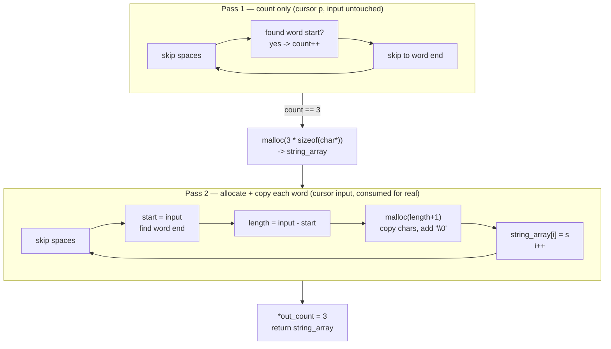
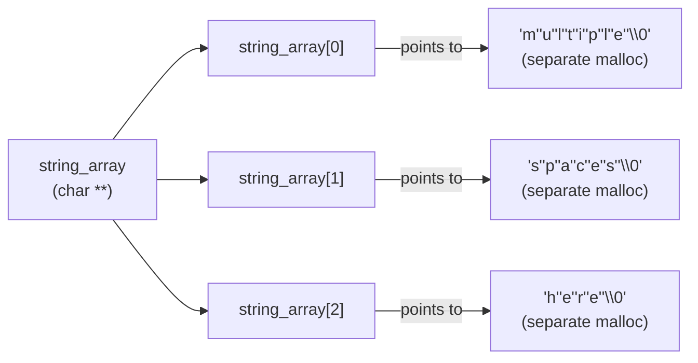

# Split Words with Pointers

**Date:** 2026-09-06

**Language:** C

**Source:** boot.dev

**Concepts:** `char **` (array of `char*`, "array of C strings") · two-pass string scanning · pointer subtraction for length (`input - start`) · heap allocation for a jagged/ragged array · defensive bounds (`i < count`) against pass disagreement · manual null-termination

---

## 🎯 The Problem

You're building a simple command parser for a text-based game. Each command is a line of text, and the job is to **split it into separate words** using pointers and dynamic memory:

```c
char **split_words(const char *input, int *out_count);
```

### Requirements

1. One or more spaces (`' '`) act as separators between words.
2. A word is any run of non-space characters.
3. Leading, trailing, and extra (multiple consecutive) spaces between words are all ignored.
4. Allocate an array of `char *` on the heap — one pointer per word.
5. Allocate a separate, null-terminated C string on the heap for each word.
6. Set `*out_count` to the number of words found.
7. If there are no words at all, set `*out_count = 0` and return `NULL`.

The tests take care of freeing everything — `split_words` itself doesn't need to free anything it allocates.

### Guarantees given

- `input` will never be `NULL`.
- `out_count` will always point to valid, writable memory.
- The returned array doesn't need its own `NULL` terminator — callers use `*out_count` to know how many entries it has.

### Examples

```c
char **words = split_words("hello world from c", &count);
// count == 4
// words[0]=="hello", words[1]=="world", words[2]=="from", words[3]=="c"

char **words = split_words("  multiple   spaces  here ", &count);
// count == 3
// words[0]=="multiple", words[1]=="spaces", words[2]=="here"

char **words = split_words("   ", &count);
// count == 0, words == NULL
```

### Hint given

Do it in **two passes** over the string: first count how many words there are, then allocate the array and each word's string and copy the characters in. Use pointer arithmetic to detect where a word starts (space-to-non-space transition) and ends (next space or `'\0'`).

---

## 🧩 My Thought Process

The two-pass hint maps directly onto a real constraint: you can't `malloc` the outer `char **` array until you know how many slots it needs, and you don't know that until you've counted the words — so the first pass has to be a pure counting pass that doesn't allocate anything yet.

**Pass 1 — counting, using a throwaway cursor.**
I didn't want to consume the real `input` pointer while counting, since I still need it intact to actually copy the words afterward — so I introduced a second pointer, `p`, initialized to `input`, and let *that* one walk forward:

This is the core engine of our code. 

The first/outer while loop checks if the pointer is not pointing to the end of the string `input` (This condition terminates the loop).

The next while loop helps us to skip and get rid of spaces in our string. so if the pointer is pointing to a space, we increment our pointer address until we get rid of all the spaces.

After getting rid of the spaces, if the string is not empty, the pointer should be pointing to a character. So we use an if condition to check if the pointer does not point to a space ` ` or a null character `\0`(This would mean our string is empty). If the condition is met, this means we have gotten to the start of a word, we increment our count by 1.

The last while loop is used to skim through the characters of the word until we encounter a space which automatically exits the loop because one of the condition for this loop is that the pointer is not pointing to ` ` or `\0`.

```c
int count = 0;
const char *p = input;
while (*p != '\0') {
    while (*p == ' ') { p++; }               // skip any run of spaces
    if (*p != ' ' && *p != '\0') { count++; } // found the start of a word
    while (*p != ' ' && *p != '\0') { p++; }  // skip to the end of that word
}
```

Each trip through the outer loop skips one run of spaces, then (if there's a word there) counts it and skips past it. By the time `p` reaches `'\0'`, `count` holds the exact number of words — and `input` itself hasn't moved at all.

**The empty-input short-circuit.**
If `count` comes out `0` (all spaces or an empty string), the spec says to set `*out_count = 0` and return `NULL` immediately — no array to allocate at all:

```c
if (count == 0) {
    *out_count = 0;
    return NULL;
}
```

**Pass 2 — allocate the outer array, then walk `input` for real.**
With `count` known, I allocate the `char **` array once:

```c
char **string_array = (char **)malloc(count * (sizeof(char *)));
```

Then I reuse almost the identical skip-spaces / find-word-boundary logic from pass 1 — but this time on the real `input` pointer, and this time I actually know *where* each word starts (`start`) and can compute its length with pointer subtraction once I find where it ends:

```c
const char *start = input;
while (*input != ' ' && *input != '\0') { input++; }
int length = input - start;
```

`input - start` is the number of `char`s between two pointers into the same string — exactly the word's length, with no manual character counting needed.

**Copying the word onto its own heap allocation.**
Each word gets `malloc(length + 1)` (`+1` for the terminator), and I copy character-by-character with a dedicated cursor (`string`) so I don't lose the original start-of-buffer pointer (`s`) that needs to go into `string_array[i]`:

```c
char *string = (char *)malloc(length + 1);
char *s = string;
while (start < input) {
    *string = *start;
    string++;
    start++;
}
*string = '\0';
string_array[i] = s;
```

This is the same "don't walk the pointer you still need to return" lesson from the earlier pointer-positions exercise in this repo, applied again here — `string` gets walked forward to do the copying, while `s` keeps the original address that actually goes into the array.

**Why `i < count` guards the second loop, not just `*input != '\0'`.**
The outer loop in pass 2 is `while (*input != '\0' && i < count)` rather than just `while (*input != '\0')`. If the counting pass and the copying pass ever disagreed about how many words there were — which they shouldn't, since they use the same skip/find logic, but it's a two-pass algorithm and the two passes are two separate pieces of code — the `i < count` bound is what stops the copy loop from writing past the end of a `count`-sized array. It's a safety net for a specific two-pass failure mode: "pass 1 counted differently than pass 2 found."

---

## ✅ My Solution

```c
#include <stdlib.h>

char **split_words(const char *input, int *out_count) {
  // count the number of words in the string.
  int count = 0;
  const char *p = input;
  while (*p != '\0') {
    while (*p == ' ') {
      p++;
    }

    if (*p != ' ' && *p != '\0') {
      count++;
    }

    while (*p != ' ' && *p != '\0') {
      p++;
    }
  }

  if (count == 0) {
    *out_count = 0;
    return NULL;
  }

  // create array of char pointers
  char **string_array = (char **)malloc(count *(sizeof(char *)));
  if (string_array == NULL) {
    return NULL;
  }

  // stride through each character, get the length, allocate a memory malloc and fix each character
  int i = 0;
  while (*input != '\0' && i < count) {
    while (*input == ' ') {
      input++;
    }

    if (*input == '\0') {
      continue;
    }

    // get length of word
    const char *start = input;
    while (*input != ' ' && *input != '\0') {
      input++;
    }
    int length = input - start;
    char *string = (char *)malloc(length + 1);
    if (string == NULL) {
      for (int j = 0; j < i; j++) {
        free(string_array[j]);
      }
      free(string_array);
      return NULL;
    }

    //fix all characters into the string and add null terminator to the end
    char *s = string;
    while (start < input) {
      *string = *start;
      string++;
      start++;
    }
    *string = '\0';

    // pass first address of the string to the address of pointer.
    string_array[i] = s;
    i++;
  }

  *out_count = count;
  return string_array;
}
```

---

## 🖼️ Visualizing the Two-Pass Approach

For `split_words("  multiple   spaces  here ", &count)`:



### The resulting memory shape — an array of pointers to independently-allocated strings



`string_array` itself is one allocation (an array of three `char*` slots). Each slot then points to its *own*, independently-sized allocation — this is why the structure is sometimes called a "ragged array": unlike a 2D array (`char[3][16]`), each row can be exactly as long as its word needs, with no wasted padding and no fixed maximum word length.

---

## ✅ Verification — Plain C, No External Test Library

Following the standard established for C exercises in this repo, I reproduced all five cases from the pasted `munit`-based test file as a dependency-free plain-C file, using the `CHECK_INT`/`CHECK_STR`/`CHECK_NULL` macro pattern (the `free_words` helper mirrors what the real test harness does for you, since this verification file has to clean up after itself):

```c
#include <stdio.h>
#include <string.h>
#include <stdlib.h>
#include "exercise.h"

static int tests_run = 0;
static int tests_passed = 0;

#define CHECK_INT(actual, expected, msg)  /* ... */
#define CHECK_NULL(actual, msg)           /* ... */
#define CHECK_STR(actual, expected, msg)  /* ... */

static void free_words(char **words, int count) {
    if (!words) return;
    for (int i = 0; i < count; i++) free(words[i]);
    free(words);
}

void test_split_words_simple(void) {
    int count = 0;
    char **words = split_words("hello world from c", &count);
    CHECK_INT(count, 4, "count");
    CHECK_STR(words[0], "hello", "word 0");
    CHECK_STR(words[1], "world", "word 1");
    CHECK_STR(words[2], "from", "word 2");
    CHECK_STR(words[3], "c", "word 3");
    free_words(words, count);
}
/* ...four more test functions, same pattern, covering spaces, empty input,
   a single word, and a trickier mixed-spacing string... */

int main(void) {
    test_split_words_simple();
    test_split_words_with_spaces();
    test_split_words_empty();
    test_split_words_single();
    test_split_words_tricky();
    printf("\n%d/%d checks passed\n", tests_passed, tests_run);
    return (tests_passed == tests_run) ? 0 : 1;
}
```

Compiled and run two ways — a plain build, and a second build under **AddressSanitizer + UndefinedBehaviorSanitizer**, specifically because this task's entire difficulty is heap bookkeeping (one array allocation plus one allocation per word, all needing to be freed without leaking, and every `malloc(length + 1)` needing to be sized exactly right):

```bash
gcc -std=c99 -Wall -Wextra -o verify_plain exercise.c verify_split_words.c
./verify_plain

gcc -std=c99 -Wall -Wextra -fsanitize=address,undefined -g -o verify_asan exercise.c verify_split_words.c
./verify_asan
```

**Result (both builds, identical):**

```
Running checks for split_words

  test_split_words_simple
  test_split_words_with_spaces
  test_split_words_empty
  test_split_words_single
  test_split_words_tricky

20/20 checks passed
```

Both exit `0`. The ASan/UBSan build is the important confirmation here: it verifies every one of the `count + 1` allocations per call (one array, one per word) is freed exactly once with no leak, and that every word's `malloc(length + 1)` buffer is filled and null-terminated without reading or writing a single byte past its own bounds — across five different spacing patterns, including an all-space input that allocates nothing at all.

---

## 🔍 Portions Worth Refactoring

**1. On `malloc` failure for a word's string, `*out_count` is never set — inconsistent with the all-spaces early-return path.**

```c
char *string = (char *)malloc(length + 1);
if (string == NULL) {
    for (int j = 0; j < i; j++) { free(string_array[j]); }
    free(string_array);
    return NULL;   /* *out_count left untouched here */
}
```

Compare this to the empty-input case, which explicitly sets `*out_count = 0` before returning `NULL`. On an out-of-memory failure partway through copying words, the function correctly frees everything it had already allocated and returns `NULL` — but leaves `*out_count` holding whatever the caller passed in (the test file's own `test_split_words_empty` deliberately pre-seeds `count = 123` specifically to catch this kind of thing). A caller checking `if (words == NULL)` would still be safe, but one that only checks `*out_count` before checking the array pointer could be misled. Setting `*out_count = 0` on every `NULL`-returning path, not just the empty-input one, would make the two failure modes consistent. This isn't reachable in the tests themselves (`malloc` isn't mocked to fail), but it's a real gap worth naming as a habit rather than a live bug.

**2. The `if (*input == '\0') { continue; }` branch inside the second loop is defensive code that pass 1 and pass 2's matching logic should make unreachable.**

Since both passes use the identical skip-spaces / find-word-boundary logic, the second pass should never actually find `*input == '\0'` right after skipping spaces while `i < count` still holds — if it ever did, that would mean the two passes disagreed about how many words exist, which would itself be a bug in the counting logic rather than something to quietly `continue` past. It's not harmful (traced through, it can't cause an infinite loop — the loop condition re-checks `*input != '\0'` immediately after the `continue` and exits), but it's worth being clear-eyed that this is a safety net for "the two passes disagreed," not an expected code path for valid input.

**3. No performance concern.**

`split_words` makes exactly two linear passes over the input string — O(n) for counting, O(n) for copying — plus O(w) allocations for `w` words. There's no way to split a string into words without reading every character at least once, so this is already at the best possible asymptotic complexity.

---

## 💡 The Core Lesson

**When you don't know a data structure's final size until you've scanned the input once, a two-pass algorithm — count first, allocate exactly once, then fill — is the natural C idiom, because C arrays can't grow after allocation the way a dynamic list in a higher-level language can.**

The alternative would be guessing a buffer size and growing it (realloc-and-double) as words are found, which avoids the first pass but adds its own complexity (tracking capacity vs. count, handling `realloc` failure mid-grow) and can still over-allocate. Counting first trades one extra linear scan for a single, exactly-sized allocation with no wasted capacity and no growth logic — a good default when the input has to be fully read anyway (as it does here, since you can't know where words start and end without scanning).

---

## 📚 Lessons Learnt

**1. `char **` is "a pointer to a pointer to `char`" — in practice, an array of C strings.**
Each `char*` slot in the outer array independently points to its own null-terminated string. The outer array and each inner string are separate allocations, freed separately.

**2. When you need to scan ahead without disturbing a pointer you still need later, use a second cursor.**
Pass 1 introduces `p = input` specifically so the counting scan doesn't consume the real `input` pointer — which pass 2 still needs to start from the beginning.

**3. Pointer subtraction between two pointers into the same array gives you a length, with no manual counting.**
`int length = input - start;` is the number of characters between where a word started and where it ended — exactly what `malloc(length + 1)` needs, computed in one expression instead of a separate counting loop.

**4. Keep one cursor for walking, one for returning.**
`string` gets walked forward character-by-character to copy each byte; `s` is kept untouched specifically so it still points at the start of the buffer when it's time to store it in `string_array[i]`. This is the same principle as `find_player` needing to preserve its original pointer in the earlier pointer-positions exercise — a function can only safely destroy a pointer value it doesn't need to use again afterward.

**5. A loop bound like `i < count` can double as a safety net against two algorithm phases disagreeing, not just as the "normal" stopping condition.**
Even though pass 1 and pass 2 use matching logic and should always agree on word count, bounding the copy loop by `i < count` (not just `*input != '\0'`) means a hypothetical disagreement between the two passes would stop the loop safely rather than writing past the end of a `count`-sized array.

**6. A function that frees its own partial work on failure, but forgets to reset an output parameter, is only half defensive.**
The out-of-memory cleanup path in `split_words` correctly frees every string allocated so far plus the outer array — but it's worth checking *every* `NULL`-returning path sets `*out_count` consistently, not just the one the task's examples happen to test.

**7. A "ragged array" (array of pointers to independently-sized allocations) is the natural C shape for a variable number of variable-length strings.**
A fixed 2D array (`char words[MAX_WORDS][MAX_LEN]`) would force a maximum word count and a maximum word length chosen in advance, wasting memory for short words and failing outright for a word longer than `MAX_LEN`. `char **` with per-word `malloc` sizes each allocation exactly, at the cost of needing a separate `free()` per word.

---

## 🔗 Further Reading

- [cppreference — Pointers to pointers](https://en.cppreference.com/w/c/language/pointer)
- [cppreference — Pointer arithmetic](https://en.cppreference.com/w/c/language/operator_arithmetic#Pointer_arithmetic) (see pointer subtraction)
- [AddressSanitizer (Google/LLVM)](https://github.com/google/sanitizers/wiki/AddressSanitizer) — what it catches and how to enable it with `-fsanitize=address`
- Next to explore: rewrite `split_words` to accept a custom separator character (not just `' '`) by parameterizing the `' '` comparisons, and consider what changes if separators can be any one of several characters (e.g. tabs *and* spaces).