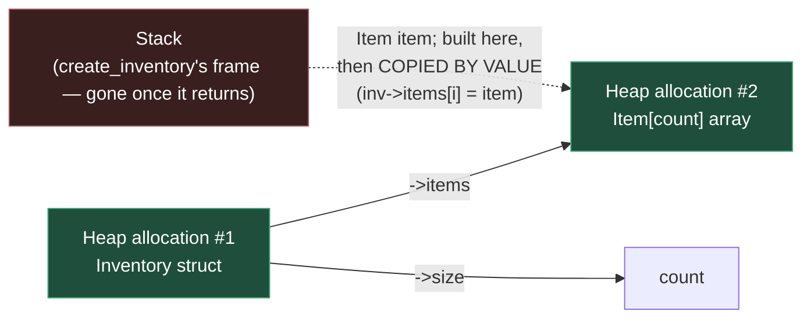
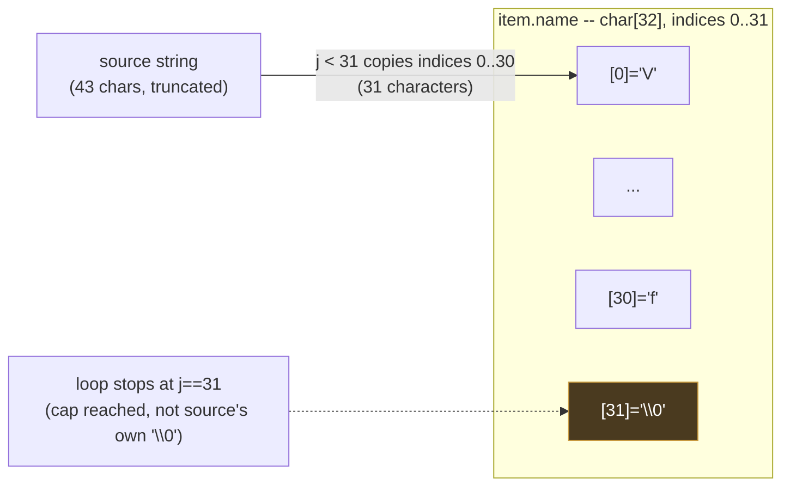

# Fix Inventory Pointers

**Date:** 2026-09-07

**Language:** C

**Source:** boot.dev

**Concepts:** nested heap allocation (a struct that owns another heap array) · bounded string copying (manual truncation, no `strncpy`) · stack-to-heap struct copy · "never return a pointer to stack memory" · defensive per-element `NULL` checks vs. redundant top-level ones · cleanup-on-partial-failure

---

## 🎯 The Problem

You're managing a small RPG inventory system in C. The inventory is a struct **on the heap**, and it owns a **dynamic array of `Item` structs**, also on the heap:

```c
typedef struct Item {
  char name[32];
  int quantity;
} Item;

typedef struct Inventory {
  Item *items;   // dynamic array of Item (Item is a struct)
  int size;      // how many items are in the array
} Inventory;

Inventory *create_inventory(const char **names, const int *quantities, int count);
void free_inventory(Inventory *inv);
```

### What `create_inventory` must do

Build a new `Inventory` on the heap from parallel arrays of names and quantities:

- If `count <= 0`, or if `names` or `quantities` is `NULL`, return `NULL` and do nothing else.
- Otherwise:
  1. Allocate an `Inventory` struct on the heap using malloc.
  2. Allocate a dynamic array of `Item` on the heap with `count` elements.
  3. For each index `i` from `0` to `count - 1`: copy the string from `names[i]` into `items[i].name` (**at most 31 characters**, always null-terminated), and set `items[i].quantity` from `quantities[i]`.
  4. Set `inventory->size` to `count`.
  5. Return a pointer to the new `Inventory`.
- The function must **never return a pointer to stack memory** — everything that survives the call has to live on the heap.
- If any allocation fails (`malloc` returns `NULL`), clean up anything already allocated and return `NULL`.

### What `free_inventory` must do

Free **all** heap memory owned by an `Inventory`:

- If `inv` is `NULL`, do nothing.
- Otherwise: free the `items` array, then free the `Inventory` struct itself.
- After the call, the pointer passed in is no longer valid.

### Example

```c
const char *names[] = {"Potion", "Elixir"};
int quantities[] = {3, 1};
Inventory *inv = create_inventory(names, quantities, 2);
// inv is not NULL
// inv->size == 2
// inv->items[0].name == "Potion", inv->items[0].quantity == 3
// inv->items[1].name == "Elixir", inv->items[1].quantity == 1
```

---

## 🧩 My Thought Process

This task is really about **ownership**: the `Inventory` struct owns its `items` array, which means both have to be allocated on the heap independently, and both have to survive after `create_inventory` returns — nothing can point back into the function's own stack frame.

**Two allocations, checked separately, with cleanup on the second failing.**

```c
Inventory *inv = malloc(sizeof(Inventory));
if (inv == NULL) {
    return NULL;
}
inv->size = count;

inv->items = malloc(sizeof(Item) * count);
if (inv->items == NULL) {
    free(inv);
    return NULL;
}
```

The `Inventory` struct and its `items` array are two separate `malloc` calls, because they're two separate pieces of memory with independent lifetimes — `free_inventory` has to be able to free the array first and the struct second, which only works if they were allocated separately to begin with. If the second allocation fails, the first one already succeeded, so it has to be explicitly freed before returning `NULL` — otherwise that first `malloc`'d block would leak with no pointer left anywhere to free it later.

**Copying each name byte-by-byte, bounded at 31 characters, instead of reaching for `strncpy`.**

```c
int j = 0;
if (names != NULL && names[i] != NULL) {
    while (names[i][j] != '\0' && j < 31) {
        item.name[j] = names[i][j];
        j++;
    }
}
item.name[j] = '\0';
```

`name` is a fixed `char[32]`, so copying into it needs an explicit upper bound — `j < 31` stops the copy one byte short of the buffer's end, leaving room for the terminator `item.name[j] = '\0'` to always fit, whether the source name was short (loop stopped at its own `'\0'`) or long (loop stopped at the 31-character cap). I deliberately didn't use `strncpy` here: `strncpy` has a well-known footgun where it does *not* guarantee null-termination if the source is exactly as long as or longer than the destination buffer — you'd still need a manual `name[31] = '\0'` afterward to be safe, at which point a plain bounded loop is no less code and doesn't carry that gotcha.

**Building the `Item` on the stack, then copying it into the heap array by value.**

```c
Item item;
/* ...fill item.name and item.quantity... */
inv->items[i] = item;
```

This is the detail that directly answers the "never return a pointer to stack memory" requirement. `item` genuinely is a local, stack-allocated variable — but it never *escapes* the function as a pointer. `inv->items[i] = item;` is a **struct assignment**, which copies `item`'s bytes (the whole 32-byte name array plus the `int`) into the heap array slot. Once that line runs, `inv->items[i]` is a completely independent copy living in heap memory; `item` going out of scope at the end of the loop iteration doesn't matter, because nothing outside the function ever held `&item` itself — only the copied *value*.

**Per-element defensive check, separate from the top-level guard.**

```c
if (count <= 0 || names == NULL || quantities == NULL) {
    return NULL;
}
/* ... */
if (names != NULL && names[i] != NULL) { /* copy */ }
```

The first check guards against `names` itself being `NULL` (the whole array pointer). The second, inner check guards against a specific *element* of a valid array being `NULL` — `names[i] == NULL` is a different failure mode the task doesn't explicitly mention, but it's a realistic one (a caller could pass a non-`NULL` array containing a `NULL` slot), and dereferencing `names[i][j]` without that check would be undefined behaviour if it happened.

---

## ✅ My Solution

```c
#include <stdlib.h>
#include "inventory.h"

Inventory *create_inventory(const char **names, const int *quantities, int count) {
  if (count <= 0 || names == NULL || quantities == NULL) {
    return NULL;
  }

  Inventory *inv = malloc(sizeof(Inventory));
  if (inv == NULL) {
    return NULL;
  }
  inv->size = count;

  inv->items = malloc(sizeof(Item) * count);
  if (inv->items == NULL) {
    free(inv);
    return NULL;
  }

  for (int i = 0; i < count; i++) {
    Item item;
    int j = 0;
    if (names != NULL && names[i] != NULL) {
      while (names[i][j] != '\0' && j < 31) {
        item.name[j] = names[i][j];
        j++;
      }
    }
    item.name[j] = '\0';
    item.quantity = quantities[i];

    inv->items[i] = item;
  }
  return inv;
}

void free_inventory(Inventory *inv) {
  if (inv == NULL) {
    return;
  }

  free(inv->items);
  free(inv);
}
```

---

## 🖼️ Visualizing the Ownership Structure



The dotted line is the important part: `item` really does live on the stack while it's being built, but what crosses into heap memory is a **byte-for-byte copy** of its value, not its address. By the time `create_inventory` returns and its stack frame is gone, nothing in the returned `Inventory` points back into that now-invalid memory — `inv` and `inv->items` are both independent heap blocks that outlive the function call.

### The name-truncation boundary

For the 43-character input `"VeryVeryVeryLongItemNameThatShouldBeCutOff"` against a 32-byte `char name[32]`:



Characters at source indices 31 and beyond (`"ThatShouldBeCutOff"`) are simply never read — the `j < 31` condition in the `while` stops the copy one slot early specifically so the terminator always has room, regardless of whether the stopping reason was "ran out of source characters" or "hit the 31-character cap."

---

## ✅ Verification — Plain C, No External Test Library

Following the standard established for C exercises in this repo, I reproduced all five cases from the pasted `munit`-based test file as a dependency-free plain-C file, using the `CHECK_INT`/`CHECK_STR`/`CHECK_PTR_NOT_NULL`/`CHECK_NULL` macro pattern:

```c
#include <stdio.h>
#include <string.h>
#include "inventory.h"

static int tests_run = 0;
static int tests_passed = 0;

#define CHECK_INT(actual, expected, msg)          /* ... */
#define CHECK_PTR_NOT_NULL(actual, msg)           /* ... */
#define CHECK_NULL(actual, msg)                   /* ... */
#define CHECK_STR(actual, expected, msg)          /* ... */

void test_inventory_basic(void) {
    const char *names[] = {"Potion", "Elixir"};
    int quantities[] = {3, 1};
    Inventory *inv = create_inventory(names, quantities, 2);
    CHECK_PTR_NOT_NULL(inv, "result");
    CHECK_INT(inv->size, 2, "size");
    CHECK_STR(inv->items[0].name, "Potion", "items[0].name");
    CHECK_INT(inv->items[0].quantity, 3, "items[0].quantity");
    CHECK_STR(inv->items[1].name, "Elixir", "items[1].name");
    CHECK_INT(inv->items[1].quantity, 1, "items[1].quantity");
    free_inventory(inv);
}

void test_inventory_independent_copy(void) {
    const char *names[] = {"Sword"};
    int quantities[] = {2};
    Inventory *inv = create_inventory(names, quantities, 1);
    names[0] = "Axe";  /* mutate AFTER creation -- stored copy must not change */
    CHECK_STR(inv->items[0].name, "Sword", "must stay \"Sword\"");
    free_inventory(inv);
}

/* ...three more test functions: zero count -> NULL, 43-char name ->
   truncated to exactly 31 chars + NUL, and a three-item case... */

int main(void) {
    test_inventory_basic();
    test_inventory_independent_copy();
    test_inventory_zero_count();
    test_inventory_truncate_name();
    test_inventory_three_items();
    printf("\n%d/%d checks passed\n", tests_passed, tests_run);
    return (tests_passed == tests_run) ? 0 : 1;
}
```

Compiled and run two ways — a plain build, and a second build under **AddressSanitizer + UndefinedBehaviorSanitizer**, specifically because this task mixes two separate heap allocations with ownership between them *and* a hand-rolled bounded string copy, which is exactly the combination where a leak or an off-by-one at the 31/32 boundary could hide:

```bash
gcc -std=c99 -Wall -Wextra -o verify_plain exercise.c verify_inventory.c
./verify_plain

gcc -std=c99 -Wall -Wextra -fsanitize=address,undefined -g -o verify_asan exercise.c verify_inventory.c
./verify_asan
```

**Result (both builds, identical):**

```
Running checks for create_inventory / free_inventory

  test_inventory_basic
  test_inventory_independent_copy
  test_inventory_zero_count
  test_inventory_truncate_name
  test_inventory_three_items

22/22 checks passed
```

Both exit `0`. The ASan/UBSan build specifically confirms: both heap allocations (`Inventory` and its `items` array) are freed exactly once with no leak across all five scenarios, the truncated name write never reads or writes past `item.name`'s 32-byte bounds, and the stack-to-heap `Item` copy never leaves a dangling reference. I added one extra check beyond the original test file's own assertions — `strlen(inv->items[0].name) == 31` on the truncation case — to directly confirm the copied name is *exactly* 31 characters (not 30 or 32), which is the precise boundary the `j < 31` condition is responsible for getting right.

---

## 🔍 Portions Worth Refactoring

**1. `names != NULL` inside the loop is dead code — the top-level guard already made it unreachable.**

```c
if (count <= 0 || names == NULL || quantities == NULL) {
    return NULL;
}
/* ... */
for (int i = 0; i < count; i++) {
    /* ... */
    if (names != NULL && names[i] != NULL) {  /* names != NULL can never be false here */
```

By the time this loop runs, the function has already returned if `names` were `NULL`. Re-checking `names != NULL` on every iteration doesn't cost much, but it reads as if the author wasn't sure whether the earlier guard covered this case — when it's the *other* half of the check, `names[i] != NULL`, that's actually doing useful work (an individual array element being `NULL` isn't ruled out by the top-level guard). Dropping the always-true `names != NULL` half and keeping only `names[i] != NULL` would make the real defensive intent clearer.

**2. Building `Item item;` on the stack and then copying it with `inv->items[i] = item;` is correct, but writes to `inv->items[i].name[j]` and `inv->items[i].quantity` directly would skip the extra struct copy.**

```c
Item item;
/* ...fill item.name[], item.quantity... */
inv->items[i] = item;
```

vs. writing straight into the destination:

```c
int j = 0;
if (names[i] != NULL) {
    while (names[i][j] != '\0' && j < 31) {
        inv->items[i].name[j] = names[i][j];
        j++;
    }
}
inv->items[i].name[j] = '\0';
inv->items[i].quantity = quantities[i];
```

Both are correct — the current version isn't a bug, just an extra 36-byte struct copy per item that a direct-write version avoids. For an inventory of any realistic size this difference is not measurable; it's worth knowing the two are equivalent rather than assuming the stack-local version is required. (It *is* a clear and arguably more readable way to build a value before committing it, so this is a genuine trade-off, not a one-sided win.)

**3. No performance concern beyond the one copy noted above.**

`create_inventory` does O(n) work for n items, plus O(k) per item for copying up to 31 characters of its name — both are the minimum work needed to read every input byte once. `free_inventory` is O(1) (two `free` calls regardless of `size`). Nothing here is sub-optimal at an algorithmic level.

---

## 💡 The Core Lesson

**"Never return a pointer to stack memory" doesn't mean "never use the stack" — it means nothing that outlives the function call may be reached *by address* through a stack variable. Building a value on the stack and then copying it by value into heap memory is completely safe, because what survives is the copy, not the stack slot it was built in.**

This is the same principle underlying why returning `&local_variable` from a function is a classic C bug (the address becomes dangling the instant the function returns), while `*out_param = local_variable;` or `heap_array[i] = local_variable;` are both fine (the *value* is copied out before the stack frame disappears). `create_inventory` relies on exactly this distinction: `item` is real stack memory, but `inv->items[i] = item;` commits its contents to heap memory before `item` ever goes away.

---

## 📚 Lessons Learnt

**1. A struct that owns a dynamic array needs two separate allocations, freed in the matching order.**
`Inventory` and its `items` array are allocated independently (`malloc(sizeof(Inventory))`, then `malloc(sizeof(Item) * count)`), and `free_inventory` frees them in the mirror order (array first, then the struct). Treating them as one conceptual unit while keeping them as two actual allocations is what "ownership" means in C.

**2. If a second allocation fails, anything the first one already succeeded in allocating must be explicitly freed before returning.**
`free(inv);` on the `inv->items == NULL` failure path exists specifically because `inv` itself was already a successful allocation — returning `NULL` without that `free` would leak it permanently, since the caller never receives a pointer to it.

**3. A fixed-size buffer needs its copy bounded by `size - 1`, not `size`, to always leave room for a terminator.**
`j < 31` on a `char[32]` buffer is the "- 1" doing its job: whatever happens, `item.name[j] = '\0'` afterward writes into index at most 31, the buffer's last valid index.

**4. `strncpy` is not a safe drop-in replacement for "copy at most N characters and always null-terminate."**
`strncpy(dest, src, n)` does not guarantee `dest` ends up null-terminated if `src` is `n` characters or longer — a widely-cited C gotcha. A manual bounded loop that explicitly writes the terminator after the copy avoids that trap entirely, at no extra code cost.

**5. Returning a pointer to stack memory and copying a stack value into heap memory are two different things — only the first is the bug the spec warns about.**
`Item item;` genuinely lives on the stack, but `inv->items[i] = item;` is a value copy, not an address escape. The spec's "never return a pointer to stack memory" rule is about addresses outliving their frame, not about whether a stack variable was used as scratch space along the way.

**6. A top-level guard and a per-element guard check different things, even when they look similar.**
`names == NULL` (checked once, before the loop) rules out the whole array pointer being invalid. `names[i] == NULL` (checked per iteration) rules out one specific slot of an otherwise-valid array being invalid. Conflating the two — or re-checking the first one inside the loop — obscures which check is actually doing defensive work.

**7. AddressSanitizer is the right tool for confirming a bounded string copy's exact boundary, not just "the string looks right."**
A functional check that `strcmp(name, expected) == 0` confirms the *characters* came out right. It doesn't, by itself, prove the copy stopped at exactly the right index rather than one byte early or late — pairing it with an explicit `strlen(name) == 31` check, and running the whole suite under ASan, is what actually confirms the 31-character cap is hit exactly, with no out-of-bounds write on either side.

---

## 🔗 Further Reading

- [cppreference — `strncpy` and why it's often misused](https://en.cppreference.com/w/c/string/byte/strncpy) (see the warning about missing null-termination)
- [cppreference — Struct/union assignment](https://en.cppreference.com/w/c/language/operator_assignment) (confirms struct assignment is a full member-wise value copy)
- [AddressSanitizer (Google/LLVM)](https://github.com/google/sanitizers/wiki/AddressSanitizer)
- Next to explore: add a `resize_inventory(Inventory *inv, int new_count)` function that grows or shrinks the `items` array with `realloc`, and work through what has to happen if `realloc` fails partway through (hint: `realloc`'s return value must be checked before overwriting the original pointer, or a failed call leaks the original block).