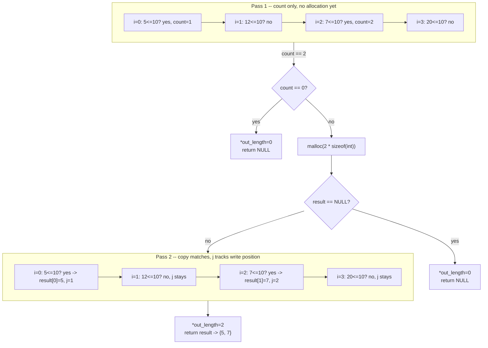

# Fix Stat Buff Pointers

**Date:** 2026-09-08

**Language:** C

**Source:** boot.dev

**Concepts:** pointer-returning search (`&stats[i]`) vs. value-returning count · two-pass "count, then allocate exactly" pattern · consistent output-parameter resets across every return path · `malloc(count * sizeof(int))` sizing

---

## 🎯 The Problem

You're working on a small combat simulator. Player stats live in arrays of `int`, and two pointer-based functions need fixing:

```c
int *first_stat_over(int *stats, int length, int threshold);
int *copy_under_limit(int *stats, int length, int limit, int *out_length);
```

### 1. `first_stat_over`

Search `stats` for the **first** value strictly greater than `threshold`.

- Return a pointer to that element **inside the original array**.
- If no element is greater than `threshold`, return `NULL`.

```c
int stats[] = {5, 12, 7, 20};
int *p = first_stat_over(stats, 4, 10);
// p should point to stats[1], and *p should be 12
```

### 2. `copy_under_limit`

Create a **heap-allocated copy** of every stat that is less than or equal to `limit`.

- Scan `stats` and collect every value `<= limit`.
- Allocate a new `int` array on the heap with **exactly** enough space for the matching elements.
- Copy the matching values into the new array, in the same order.
- Store the number of copied values in `*out_length`.
- Return the pointer to the new array.
- If **no** values are `<= limit`: set `*out_length = 0` and return `NULL`.
- If `malloc` fails: set `*out_length = 0` and return `NULL`.

```c
int stats[] = {5, 12, 7, 20};
int count = 0;
int *low = copy_under_limit(stats, 4, 10, &count);
// low should point to a HEAP array: {5, 7}
// count should be 2
// low[0] == 5, low[1] == 7
// the caller is responsible for calling free(low);
```

### What's wrong with the starting code

The task's own starter has two logic errors: `first_stat_over` doesn't correctly handle the "nothing is above the threshold" case, and `copy_under_limit` doesn't correctly size its heap allocation or correctly report how many values it copied. The fix has to use pointers correctly (`int *` and `&stats[i]`), understand that `copy_under_limit`'s return value lives on the heap and must come from `malloc`, and handle both edge cases (no matches, allocation failure) safely — without changing any test code.

---

## 🧩 My Thought Process

**`first_stat_over` — a single linear scan with an early return.**

```c
for (int i = 0; i < length; i++) {
    if (stats[i] > threshold) {
        return &stats[i];
    }
}
return NULL;
```

This is a search, not a transformation, so one pass is enough: walk the array, and the instant a value strictly greater than `threshold` shows up, hand back its address and stop. `&stats[i]` is the address-of-an-indexed-element form — equivalent to `stats + i`, just written with indexing syntax instead of pointer arithmetic (the same `*(ptr + i)` ⇔ `ptr[i]` equivalence from earlier pointer exercises in this repo). The function only needs a real answer to "is there one, and where" — so falling off the end of the loop and reaching `return NULL;` is exactly the "no such element" case, with no separate flag or sentinel needed.

I added `if (stats == NULL || length <= 0) return NULL;` up front — this task doesn't give the same "pointers are always valid" guarantee some earlier exercises did, so treating a `NULL` array or a non-positive length as "nothing to search, return not-found" felt like the safer default rather than assuming it can't happen.

**`copy_under_limit` — two passes, because the array size has to be known before it's allocated.**

This is the same shape of problem as the earlier split-words exercise: you cannot `malloc` an array of *exactly* the right size until you know how many elements will go in it, and you don't know that until you've scanned the input once. So:

```c
int count = 0;
for (int i = 0; i < length; i++) {
    if (stats[i] <= limit) {
        count++;
    }
}
```

Pass one counts matches only — no allocation, no copying yet. Then the two early-outs:

```c
if (count == 0) {
    *out_length = 0;
    return NULL;
}

int *result = malloc(count * sizeof(int));
if (result == NULL) {
    *out_length = 0;
    return NULL;
}
```

Both `NULL`-returning paths — "nothing matched" and "allocation failed" — explicitly reset `*out_length` to `0` before returning. I made a point of keeping that consistent across *both* paths rather than only the first one, specifically because a caller might check `*out_length` before checking whether the returned pointer is `NULL`.

Pass two walks the array again, this time actually copying matches into `result`, tracked with a separate index `j` that only advances when a value is actually copied (so matches land contiguously at indices `0..count-1`, with no gaps for skipped values):

```c
int j = 0;
for (int i = 0; i < length; i++) {
    if (stats[i] <= limit) {
        result[j] = stats[i];
        j++;
    }
}
*out_length = count;
return result;
```

Using two separate loop variables (`i` for "where am I in the source array" and `j` for "how many have I written so far") keeps the two concerns — scanning position vs. write position — from being conflated into one counter that would otherwise have to do double duty.

---

## ✅ My Solution

```c
#include <stdlib.h>

int *first_stat_over(int *stats, int length, int threshold) {
  if (stats == NULL || length <= 0) {
    return NULL;
  }

  for (int i = 0; i < length; i++) {
    if (stats[i] > threshold) {
      return &stats[i];
    }
  }
  return NULL;
}

int *copy_under_limit(int *stats, int length, int limit, int *out_length) {
  if (stats == NULL || length <= 0) {
    return NULL;
  }

  int count = 0;
  for (int i = 0; i < length; i++) {
    if (stats[i] <= limit) {
      count++;
    }
  }

  if (count == 0) {
    *out_length = 0;
    return NULL;
  }

  int *result = malloc(count * sizeof(int));
  if (result == NULL) {
    *out_length = 0;
    return NULL;
  }

  int j = 0;
  for (int i = 0; i < length; i++) {
    if (stats[i] <= limit) {
      result[j] = stats[i];
      j++;
    }
  }

  *out_length = count;

  return result;
}
```

---

## 🖼️ Visualizing `copy_under_limit`'s Two Passes

For `copy_under_limit({5, 12, 7, 20}, 4, 10, &count)`:



Notice `i` and `j` move independently in pass two: `i` always advances (it's scanning position in the source), while `j` only advances on an actual match (it's write position in the destination) — this is what keeps the copied values packed with no gaps, even though the matching elements (`5` at index 0, `7` at index 2) weren't adjacent in the original array.

---

## ✅ Verification — Plain C, No External Test Library

Following the standard established for C exercises in this repo, I reproduced all four cases from the pasted `munit`-based test file as a dependency-free plain-C file, using the `CHECK_INT`/`CHECK_PTR_NOT_NULL`/`CHECK_NULL` macro pattern. This task has no `exercise.h`, matching the earlier split-words exercise — boot.dev's own `main.c` forward-declares both functions directly, so this file does the same:

```c
#include <stdio.h>
#include <stdlib.h>

int *first_stat_over(int *stats, int length, int threshold);
int *copy_under_limit(int *stats, int length, int limit, int *out_length);

static int tests_run = 0;
static int tests_passed = 0;

#define CHECK_INT(actual, expected, msg)         /* ... */
#define CHECK_PTR_NOT_NULL(actual, msg)          /* ... */
#define CHECK_NULL(actual, msg)                  /* ... */

void test_pointers_run_basic(void) {
    int stats[] = {5, 12, 7, 20};
    int *p = first_stat_over(stats, 4, 10);
    CHECK_PTR_NOT_NULL(p, "first_stat_over(stats, 4, 10)");
    CHECK_INT(*p, 12, "first stat over 10");
    /* ...second threshold check... */
}

void test_pointers_run_copy(void) {
    int stats[] = {5, 12, 7, 20};
    int out_len = 0;
    int *copied = copy_under_limit(stats, 4, 10, &out_len);
    CHECK_INT(out_len, 2, "out_len");
    CHECK_INT(copied[0], 5, "copied[0]");
    CHECK_INT(copied[1], 7, "copied[1]");
    free(copied);
}
/* ...submit-group tests: no-match case for first_stat_over, and both the
   all-match and no-match edges for copy_under_limit... */

int main(void) {
    test_pointers_run_basic();
    test_pointers_run_copy();
    test_pointers_submit_first();
    test_pointers_submit_copy_edges();
    printf("\n%d/%d checks passed\n", tests_passed, tests_run);
    return (tests_passed == tests_run) ? 0 : 1;
}
```

Compiled and run two ways — a plain build, and a second build under **AddressSanitizer + UndefinedBehaviorSanitizer**, specifically because `copy_under_limit`'s `malloc(count * sizeof(int))` sizing, computed from a count produced in a separate earlier pass, is exactly the kind of "two numbers that have to agree" situation where an off-by-one would show up as a silent heap overflow:

```bash
gcc -std=c99 -Wall -Wextra -o verify_plain exercise.c verify_stat_pointers.c
./verify_plain

gcc -std=c99 -Wall -Wextra -fsanitize=address,undefined -g -o verify_asan exercise.c verify_stat_pointers.c
./verify_asan
```

**Result (both builds, identical):**

```
Running checks for first_stat_over / copy_under_limit

  test_pointers_run_basic
  test_pointers_run_copy
  test_pointers_submit_first
  test_pointers_submit_copy_edges

18/18 checks passed
```

Both exit `0`. The ASan/UBSan build confirms the count from pass one and the number of elements actually written in pass two always agree — no out-of-bounds write on `result`, and the allocation returned by `copy_under_limit` is freed cleanly with no leak across all four test scenarios, including the all-match and no-match edge cases.

---

## 🔍 Portions Worth Refactoring

**1. `first_stat_over` and the counting loop in `copy_under_limit` are structurally similar scans — not worth merging.**

```c
for (int i = 0; i < length; i++) { if (stats[i] > threshold) { return &stats[i]; } }  /* search, stops early */
for (int i = 0; i < length; i++) { if (stats[i] <= limit) { count++; } }              /* count, always scans fully */
```

Both walk the array with a per-element comparison, but one returns on the first hit and the other must examine every element regardless of matches (it needs the *total* count, not just "does one exist"). Trying to share this as one generic "scan with a predicate" helper would need a callback and a mode flag to express "stop on first match" vs. "count all matches" — more machinery than two three-line loops justify here.

**2. `copy_under_limit`'s two passes repeat the same `stats[i] <= limit` condition — correct, but a candidate for a named helper if this predicate gets reused elsewhere.**

Right now the comparison is written out twice (once to count, once to copy). For exactly two occurrences in one function, inlining is more readable than introducing a one-line `static inline` predicate function — but if a third function in this file needed the same "is this stat under the limit" check, pulling it into a small helper would be the point where that stops being true.

**3. No performance concern.**

`first_stat_over` is O(n) worst case (and can return early, so often faster in practice) — the minimum possible for "find the first element matching a condition" with no additional structure (sorting, indexing) to exploit. `copy_under_limit` is O(n) — two linear passes is still O(n), not O(n²) — which is the minimum for "read every element, then write out the subset that matches," since you can't decide how big the output array needs to be without having looked at every input element at least once.

---

## 💡 The Core Lesson

**A function that searches and a function that filters-and-copies look superficially similar (`int *` return, array and a comparison value as parameters) but have fundamentally different shapes: a search can stop the instant it finds an answer, while a filter-and-copy into a heap array has to know the total match count *before* it can allocate — which forces a second pass no matter how early a match shows up.**

`first_stat_over` never needs a count of anything; it needs one address, as early as possible. `copy_under_limit` cannot shortcut past "count everything first," because `malloc(count * sizeof(int))` needs a correct `count` up front — there's no way to grow a C array mid-scan without `realloc`-and-resize machinery, which the two-pass count-then-allocate approach avoids entirely by paying for one extra linear scan instead.

---

## 📚 Lessons Learnt

**1. `&stats[i]` and `stats + i` are the same address — indexing syntax and pointer arithmetic are interchangeable here.**
Returning `&stats[i]` instead of `stats + i` is a style choice, not a different operation; both compute "the address of the i-th element."

**2. A search function's "not found" case is often just what happens when the loop finishes without returning early — no separate sentinel tracking needed.**
`first_stat_over` doesn't track "did I find one?" in a boolean; reaching `return NULL;` after the loop *is* the not-found signal, exactly because nothing inside the loop returned first.

**3. When an allocation's size depends on how many items match a condition, you need to count before you can allocate.**
`copy_under_limit` can't call `malloc` until `count` is known, because C arrays are fixed-size once allocated — this is the same two-pass "count, then allocate exactly" idiom used for the earlier split-words exercise in this repo, just applied to `int`s satisfying a numeric condition instead of words separated by spaces.

**4. Two independent loop counters — one for read position, one for write position — keep a filter-copy's logic honest.**
`i` always advances (full scan of the source); `j` only advances on a match (packed write into the destination). Conflating them into a single counter would either skip source elements or leave gaps in the destination.

**5. Every `NULL`-returning path should reset its output parameter the same way, not just the first one written.**
`copy_under_limit` sets `*out_length = 0` on both the "no matches" path and the "`malloc` failed" path — treating them identically means a caller checking `*out_length` before checking the returned pointer gets a consistent, honest answer regardless of which failure occurred.

**6. A two-pass algorithm costs one extra linear scan, not a change in asymptotic complexity.**
Counting first and copying second is still O(n) overall — two separate O(n) passes sum to O(n), not O(n²). The cost is real (the array gets read twice) but it buys an exactly-sized allocation with zero wasted capacity and no `realloc`-and-grow bookkeeping.

**7. AddressSanitizer is the right way to confirm a "two numbers must agree" invariant, not just a passing test count.**
`copy_under_limit`'s correctness depends on the count from pass one exactly matching the number of elements pass two actually writes. A functional pass/fail count confirms the *values* came out right; running the same binary under `-fsanitize=address` is what actually proves `result` was never written one element past its `malloc`'d size.

---

## 🔗 Further Reading

- [cppreference — Pointer declaration and `&` (address-of)](https://en.cppreference.com/w/c/language/operator_member_access)
- [cppreference — `malloc`](https://en.cppreference.com/w/c/memory/malloc)
- [AddressSanitizer (Google/LLVM)](https://github.com/google/sanitizers/wiki/AddressSanitizer)
- Next to explore: write a `count_stats_over(int *stats, int length, int threshold)` that returns *how many* elements exceed a threshold (not just the first one, and not a copy) — a good check on whether "search for first" and "count all matching" really do need to stay separate functions, or whether `first_stat_over` could be rewritten in terms of a more general counting/filtering primitive.