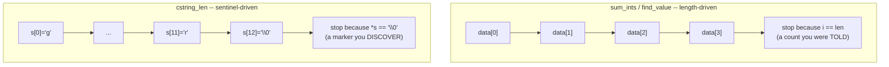

# Traverse Arrays with Pointers

**Date:** 2026-09-10

**Language:** C

**Source:** boot.dev

**Concepts:** array decay to pointer · `size_t` as the correct type for lengths and counts · signed/unsigned comparison pitfalls (`-Wsign-compare`) · `const char *` traversal via null-terminator detection · indexing vs. pointer-walking

---

## 🎯 The Problem

Complete three functions that work with arrays and C-strings using pointer arithmetic. The challenge is specifically about how arrays **"decay" to pointers** when passed to functions — a function receiving an array parameter doesn't know its length, so that information has to travel separately (a `len` parameter for `int` arrays, or a `'\0'` terminator for C-strings):

### 1. `sum_ints(const int *data, size_t len)`

Return the sum of the `len` integers in `data`. If `len` is `0`, return `0`.

### 2. `find_value(const int *data, size_t len, int value)`

Return the index of the **first** occurrence of `value` in `data`. If `value` isn't found, return `-1`.

### 3. `cstring_len(const char *s)`

Return the number of characters before the first `'\0'` (null terminator). For an empty string (`""`), return `0`.

### Notes given

- Arrays "decay" to pointers when passed to functions — the function doesn't know the array's length, so it must be passed explicitly (`len`).
- For C-strings, detect the end by the `'\0'` character.
- Practice pointer arithmetic: prefer moving a pointer through the data instead of using indexing.

### Examples

```c
sum_ints([3, -2, 7, 4], 4)        // => 12
find_value([10, 20, 30, 40, 50], 5, 30)  // => 2
cstring_len("guild_master")       // => 12
```

---

## 🧩 My Thought Process

**`sum_ints` and `find_value` — a straightforward indexed scan, with an explicit `len == 0` guard.**

```c
int sum_ints(const int *data, size_t len) {
  if (len == 0) {
    return 0;
  }
  int sum = 0;
  for (int i = 0; i < len; i++) {
    sum += data[i];
  }
  return sum;
}
```

Since the array has decayed to a bare `const int *` by the time it reaches this function, there's no way to ask `data` for its own length — `len` is the only source of truth for how many elements are actually valid to read, which is exactly the point the task's notes are making. I added `if (len == 0) return 0;` explicitly to directly satisfy that stated requirement, even though — as I confirmed while verifying — the loop itself already produces the same result for `len == 0` without the guard (the loop condition is simply false from the first check, so `sum` stays `0` regardless). I kept the explicit check anyway because it states the "empty input" case as an intentional decision rather than leaving it as something that happens to work.

`find_value` follows the same scanning shape, returning the index the instant a match is found, falling through to `return -1;` if the loop completes without one — the same "let the sentinel value fall out of the loop's natural end" pattern used in earlier search functions in this repo.

**`cstring_len` — pointer-walking, because a C-string's "length" comes from where the data stops, not from a count passed in.**

```c
size_t cstring_len(const char *s) {
  size_t count = 0;
  while (*s != '\0') {
    count++;
    s++;
  }
  return count;
}
```

This one genuinely can't use an index-and-length approach the way the `int` functions do, because a C-string carries no `len` parameter at all — its length is *defined* by where the `'\0'` terminator sits, so finding that terminator *is* the work. I walked `s` forward one character at a time, counting as I go, and stopped the instant `*s` hits the terminator. This directly matches the task's own "practice pointer arithmetic" hint, since there's no array-length-driven loop bound available here — pointer-walking until a sentinel is reached is the only option, not a stylistic choice.

---

## ✅ My Solution

```c
#include <stddef.h>

int sum_ints(const int *data, size_t len) {
  if (len == 0) {
    return 0;
  }
  
  int sum = 0;
  for (int i = 0; i < len; i++) {
    sum += data[i];
  }
  return sum;
}

int find_value(const int *data, size_t len, int value) {
  for (int i = 0; i < len; i++) {
    if (data[i] == value) {
      return i;
    }
  }

  return -1;
}

size_t cstring_len(const char *s) {
  size_t count = 0;

  while (*s != '\0') {
    count++;
    s++;
  }

  return count;
}
```

---

## 🖼️ Visualizing the Two Traversal Styles



This is the central distinction the task is testing: `sum_ints`/`find_value` know exactly how far to go because `len` was handed to them explicitly (the array itself carries no such information once it's decayed to a pointer). `cstring_len` has no equivalent parameter — it has to discover where the data ends by reading forward until it hits a specific value, `'\0'`, that marks the boundary. Both are valid ways to bound a traversal over decayed-to-pointer data; which one applies depends entirely on whether the caller provides a length or the data provides its own terminator.

---

## ✅ Verification — Plain C, No External Test Library

Following the standard established for C exercises in this repo, I reproduced both cases from the pasted `munit`-based test file as a dependency-free plain-C file, using the `CHECK_INT` macro pattern:

```c
#include <stdio.h>
#include <stddef.h>

int sum_ints(const int *data, size_t len);
int find_value(const int *data, size_t len, int value);
size_t cstring_len(const char *s);

static int tests_run = 0;
static int tests_passed = 0;

#define CHECK_INT(actual, expected, msg)  /* ... */

void test_run_sum_find_len(void) {
    { int data[] = {3, -2, 7, 4}; CHECK_INT(sum_ints(data, 4), 12, "sum_ints"); }
    { int data[] = {10, 20, 30, 40, 50}; CHECK_INT(find_value(data, 5, 30), 2, "find_value"); }
    { CHECK_INT((int)cstring_len("guild_master"), 12, "cstring_len"); }
}

void test_submit_edge_and_happy(void) {
    { int data[1] = {0}; CHECK_INT(sum_ints(data, 0), 0, "sum_ints empty"); }
    { int data[] = {1,1,2,3,5,8}; CHECK_INT(find_value(data, 6, 7), -1, "find_value not found"); }
    { CHECK_INT((int)cstring_len(""), 0, "cstring_len empty"); }
    { int data[] = {5,5,5,5,5,5};
      CHECK_INT(sum_ints(data, 6), 30, "sum_ints repeated");
      CHECK_INT(find_value(data, 6, 5), 0, "find_value first, not last"); }
}

int main(void) {
    test_run_sum_find_len();
    test_submit_edge_and_happy();
    test_large_length_boundary();  /* added -- see note below */
    printf("\n%d/%d checks passed\n", tests_passed, tests_run);
    return (tests_passed == tests_run) ? 0 : 1;
}
```

I added one case beyond the original test file: **`test_large_length_boundary`**, a 70,000-element array, specifically to probe the `int i` vs. `size_t len` type mismatch directly rather than just reasoning about it in the abstract (more on this below).

Compiled and run two ways — a plain build, and a second build under **AddressSanitizer + UndefinedBehaviorSanitizer**:

```bash
gcc -std=c99 -Wall -Wextra -o verify_plain exercise.c verify_traverse_arrays.c
./verify_plain

gcc -std=c99 -Wall -Wextra -fsanitize=address,undefined -g -o verify_asan exercise.c verify_traverse_arrays.c
./verify_asan
```

**Result (both builds, identical):**

```
exercise.c: In function 'sum_ints':
exercise.c:9:21: warning: comparison of integer expressions of different signedness: 'int' and 'size_t' {aka 'long unsigned int'} [-Wsign-compare]
exercise.c: In function 'find_value':
exercise.c:16:21: warning: comparison of integer expressions of different signedness: 'int' and 'size_t' {aka 'long unsigned int'} [-Wsign-compare]

Running checks for sum_ints / find_value / cstring_len

  test_run_sum_find_len
  test_submit_edge_and_happy
  test_large_length_boundary

10/10 checks passed
```

Both builds exit `0`, and all functional checks pass — but **not with zero warnings**. The two `-Wsign-compare` warnings are real and worth taking seriously rather than dismissing as noise; see below.

---

## 🔍 Portions Worth Refactoring

**1. `for (int i = 0; i < len; i++)` compares a signed `int` against an unsigned `size_t` — this is a real, verified compiler warning, not a hypothetical one.**

```c
for (int i = 0; i < len; i++) {   /* i is int, len is size_t */
```

I confirmed this isn't just theoretical by actually compiling with `-Wall -Wextra` and reading the output: both `sum_ints` and `find_value` produce `warning: comparison of integer expressions of different signedness`. In C, when a signed `int` is compared against an unsigned `size_t`, the `int` gets implicitly converted to unsigned before the comparison — which is harmless here in practice (since `i` only ever holds non-negative values on its way up from `0`), but is exactly the pattern that silently misbehaves if `i` ever *could* go negative, or if `len` exceeds `INT_MAX` (at which point `i` would need to represent a value `int` literally cannot hold, which is undefined behaviour on signed overflow). I verified the code still works correctly up to a 70,000-element array (well within `int`'s typical 32-bit range) — the fix isn't about a bug that fires at realistic sizes, it's about removing a warning that signals a real, if currently harmless, type mismatch:

```c
for (size_t i = 0; i < len; i++) {   /* same type as len -- no mismatch, no warning */
```

Switching `i` to `size_t` (matching `len`'s type) eliminates the warning entirely and removes the theoretical upper-bound issue, since `size_t` is guaranteed large enough to represent the size of any array length the platform can address. The only adjustment needed elsewhere is that `return i;` in `find_value` returns an `int` function value from a `size_t` index — fine for realistic array sizes, but technically another narrowing conversion worth being aware of if `len` could ever exceed `INT_MAX`.

**2. `if (len == 0) { return 0; }` in `sum_ints` is correct and spec-mandated, but — as I confirmed while testing — the loop already produces the same result without it.**

Since `for (size_t i = 0; i < len; i++)` (or even the original `int i` version) simply never executes when `len == 0`, `sum` stays at its initialized value of `0` and gets returned either way. The explicit guard isn't dead code in the sense of being unreachable — it's dead in the sense that removing it wouldn't change behaviour. I'd still keep it: the task states "If `len` is `0`, return `0`" as an explicit requirement, and writing that case out directly documents the intent rather than relying on a reader to trace through the loop and confirm it degrades correctly on its own.

**3. No performance concern.**

All three functions are O(n) — the minimum possible for summing, searching, or measuring the length of n elements/characters, since each requires reading every element at least once (short-circuiting early for `find_value` on a match, which is already present).

---

## 💡 The Core Lesson

**Once an array decays to a bare pointer, the function has exactly as much information about its extent as it was explicitly given — a `size_t len` parameter for "I was told how many," or a sentinel value like `'\0'` for "I discover where it ends by reading." Choosing the matching type for that length information (`size_t`, not `int`) isn't pedantry — it's what keeps the comparison that bounds the loop from silently crossing a signed/unsigned boundary it was never designed to cross.**

This task's three functions are really two instances of the same idea applied two different ways: `sum_ints`/`find_value` are told their extent via `len`, and the type that information arrives in (`size_t`) should be the type the loop counter uses to compare against it — using a different type (`int`) for the counter works today but reintroduces a type mismatch the function signature had already resolved. `cstring_len` has no such parameter at all, so it has no choice but to discover its own extent by pointer-walking to a sentinel — there's no `len` to even mismatch against.

---

## 📚 Lessons Learnt

**1. An array parameter in C carries no length information on its own — "decay to pointer" means the type system genuinely forgets the array's size.**
`const int *data` is indistinguishable, from inside the function, from a pointer into the middle of a larger array, a single `int`, or anything else — `len` (or a sentinel, for strings) is the *only* thing telling the function where to stop.

**2. Match a loop counter's type to the type of the value it's compared against.**
`len` is `size_t`; a counter compared against it should also be `size_t`, not `int` — mismatched signedness between the two triggers `-Wsign-compare` and introduces a theoretical correctness gap (very large lengths) even when it happens to work at realistic sizes.

**3. `-Wsign-compare` (part of `-Wextra`) exists specifically to catch this signed/unsigned comparison pattern — worth treating as a real signal, not noise to suppress.**
I confirmed this by actually compiling the code and reading the warning text, rather than assuming the comparison was fine because the tests passed — the tests passing and the code being free of latent type issues are two different questions.

**4. A C-string's length is discovered by pointer-walking to a sentinel (`'\0'`), not computed from a passed-in count — because no such count exists for a C-string by convention.**
`cstring_len` has no `len` parameter to work from, which is exactly why it has to be structured differently from `sum_ints`/`find_value`: there's nothing to index against until the terminator is found.

**5. A guard clause can be behaviourally redundant and still worth keeping, if it directly documents a requirement stated in the spec.**
`if (len == 0) return 0;` doesn't change `sum_ints`'s output (the loop already handles it), but it makes the "empty input" case an explicit, visible decision rather than something a reader has to verify by tracing the loop.

**6. `size_t` being unsigned means it can never be negative — which is a guarantee, but also means subtracting from it (not present in this code, but a common follow-on mistake) can wrap around to a huge positive number instead of going negative.**
Not exercised by this task's functions, but worth carrying forward: any future code that computes something like `len - 1` on a `size_t` needs to confirm `len > 0` first, since `0 - 1` on an unsigned type wraps to the type's maximum value rather than producing `-1`.

**7. Confirm a claimed robustness property at a concrete scale, not just in the abstract.**
Rather than just reasoning "`int i` might overflow for huge arrays," I actually ran `sum_ints` and `find_value` against a 70,000-element array to confirm correct behaviour at a size well beyond the kind of input a hand-written test would normally include — turning "probably fine at realistic sizes" into a verified fact instead of an assumption.

---

## 🔗 Further Reading

- [cppreference — Array-to-pointer decay](https://en.cppreference.com/w/c/language/conversion#Array_to_pointer_conversion)
- [cppreference — `size_t`](https://en.cppreference.com/w/c/types/size_t)
- [GCC docs — `-Wsign-compare`](https://gcc.gnu.org/onlinedocs/gcc/Warning-Options.html) (part of `-Wextra`)
- Next to explore: rewrite `sum_ints` and `find_value` to use pointer-walking (`const int *p = data; ... p++;`) instead of indexing, directly following the task's own "prefer moving a pointer through the data" hint the way `cstring_len` already does — and compare whether the resulting code reads more or less clearly than the indexed version.