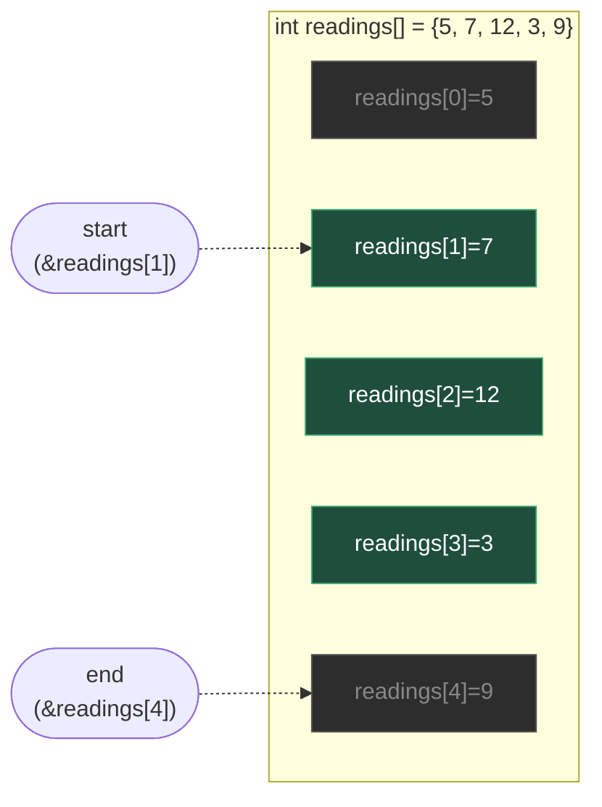
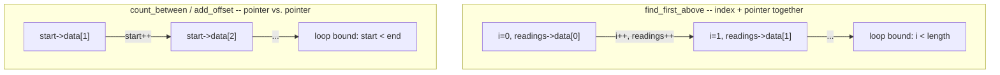

# Analyze Sensor Readings with Pointers

**Date:** 2026-10-05

**Language:** C

**Source:** boot.dev

**Concepts:** combined index-and-pointer loop increment (`i++, readings++`) · half-open range `[start, end)` via two pointers into the same array · in-place mutation through a pointer (`*start += offset`) · pure-pointer traversal vs. index-plus-pointer traversal

---

## 🎯 The Problem

You're working on a small sensor analyzer in C. All readings live in a regular C array of `int`, and three pointer-based functions need completing:

### 1. `find_first_above(int *readings, int length, int limit)`

Return a pointer to the **first** element in `readings` that is strictly greater than `limit`.

- If no reading is greater than `limit`, return `NULL`.
- Do **not** allocate memory — return a pointer into the existing array.

```c
int data[] = {5, 7, 12, 3, 9};
int *p = find_first_above(data, 5, 10);
// p points to data[2], *p is 12
```

### 2. `count_between(int *start, int *end)`

`start` and `end` are pointers into the **same array**, describing the half-open range **`[start, end)`**:

- `start` points to the first element in the range.
- `end` points **just past** the last element in the range.

Return how many integers are in that range — i.e., starting at `start`, how many times you can increment the pointer (`p++`) before it becomes equal to `end`.

```c
int data[] = {10, 20, 30, 40, 50};
int *start = &data[1];  // value 20
int *end   = &data[4];  // points just before value 50
int n = count_between(start, end);
// Range is {20, 30, 40}, n == 3
```

### 3. `add_offset(int *start, int *end, int offset)`

Again treat `[start, end)` as a half-open range. For every integer in that range, add `offset` to it **in-place**.

- Do **not** create a new array.
- Modify the existing elements through the pointers.

```c
int data[] = {3, 5, 8, 10};
int *start = &data[1];  // value 5
int *end   = &data[4];  // just past value 10
add_offset(start, end, 2);
// data is now {3, 7, 10, 12}
```

### Guarantee given

`start <= end` always holds for `count_between` and `add_offset` — the caller never passes a reversed range.

### Hints given

- Use simple `while` or `for` loops.
- For the range functions, it's often easiest to use a pointer variable that starts at `start` and moves toward `end` with `p++`.
- When comparing pointers in the same array, `<`, `<=`, and `==` all work.
- No dynamic memory, structs, or advanced libraries needed.

---

## 🧩 My Thought Process

**`find_first_above` — walk the pointer forward, with an index riding alongside it as the loop bound.**

```c
for (int i = 0; i < length; i++, readings++) {
    if (*readings > limit) {
        return readings;
    }
}
return NULL;
```

I used `length` as the loop bound (since this function only gets a count, not a second pointer marking the end), and advanced `readings` itself in the increment clause alongside `i` — `i++, readings++` moves both together, so by the time the loop has run `i` times, `readings` has also moved `i` positions forward from where it started. The moment `*readings > limit`, `readings` is already pointing at the matching element's actual address, so returning it directly hands back a pointer *into the original array*, exactly as the spec requires ("do not allocate memory, just return a pointer into the existing array").

Because `readings` is a local copy of the pointer the caller passed in (C passes pointers by value), walking it forward here doesn't disturb anything on the caller's side — the caller's own array and their own pointer variable, if they had one, are untouched.

**`count_between` and `add_offset` — no index at all, just two pointers compared directly.**

```c
int count_between(int *start, int *end) {
  if (start == NULL || end == NULL) {
    return 0;
  }
  int count = 0;
  while (start < end) {
    count += 1;
    start++;
  }
  return count;
}
```

These two functions already get *both* ends of their range as pointers, so there's no need for a separate length or index — `start < end` is both the loop condition and the thing being measured. Each trip through the loop advances `start` one position and increments `count` once, so by the time `start` has walked all the way up to `end` (at which point `start < end` becomes false and the loop stops), `count` holds exactly the number of steps it took to get there — which is exactly "how many integers are in `[start, end)`."

`add_offset` is structurally identical, just doing `*start += offset;` instead of incrementing a counter:

```c
void add_offset(int *start, int *end, int offset) {
  if (start == NULL || end == NULL) {
    return;
  }
  while (start < end) {
    *start += offset;
    start++;
  }
}
```

Both functions stop exactly at `end` without ever reading or writing through it — `end` marks "one past the last element to touch," so dereferencing `*end` itself would be out of range for the intended operation, and the `start < end` condition (not `start <= end`) is what keeps the loop from ever doing that.

I added the `start == NULL || end == NULL` guards defensively — the spec doesn't explicitly say these pointers are guaranteed non-`NULL` the way it guarantees `start <= end`, so I treated a `NULL` range the same way an empty range is treated: nothing to count, nothing to modify.

---

## ✅ My Solution

```c
#include <stddef.h>

int *find_first_above(int *readings, int length, int limit) {
  for (int i = 0; i < length; i++,readings++) {
    if (*readings > limit) {
      return readings;
    }
  }
  return NULL;
}

int count_between(int *start, int *end) {
  if (start == NULL || end == NULL) {
    return 0;
  }
  int count = 0;
  while (start < end) {
    count += 1;
    start++;
  }

  return count;
}

void add_offset(int *start, int *end, int offset) {
  if (start == NULL || end == NULL) {
    return;
  }

  while (start < end) {
    *start += offset;
    start++;
  }
}
```

---

## 🖼️ Visualizing the Half-Open Range

For `add_offset(&readings[1], &readings[4], 1)` against `readings = {5, 7, 12, 3, 9}`:



`readings[1]` through `readings[3]` (green) are inside `[start, end)` and get `+1`; `readings[4]` (grey) is where `end` points — never read or written by the loop — and `readings[0]` (also grey) is before the range entirely. The test confirms exactly this: after the call, `readings[4]` stays `9` ("element at end pointer is unchanged") while `readings[1..3]` each increase by `1`.

### Two ways to bound a forward pointer walk



Both are correct, and the choice between them comes down to what information the function was actually given: `find_first_above` only receives a `length`, so it needs a counter (or an end pointer it computes itself) to know when to stop; `count_between`/`add_offset` already receive a second pointer marking the boundary, so comparing pointer-to-pointer is both sufficient and simpler — no separate counter needed at all.

---

## ✅ Verification — Plain C, No External Test Library

Following the standard established for C exercises in this repo, I reproduced all five cases from the pasted `munit`-based test file as a dependency-free plain-C file, using the `CHECK_INT`/`CHECK_PTR`/`CHECK_PTR_NOT_NULL`/`CHECK_NULL` macro pattern:

```c
#include <stdio.h>
#include <stddef.h>

int *find_first_above(int *readings, int length, int limit);
int count_between(int *start, int *end);
void add_offset(int *start, int *end, int offset);

static int tests_run = 0;
static int tests_passed = 0;

#define CHECK_INT(actual, expected, msg)        /* ... */
#define CHECK_PTR_NOT_NULL(actual, msg)         /* ... */
#define CHECK_NULL(actual, msg)                 /* ... */
#define CHECK_PTR(actual, expected, msg)        /* ... */

void test_pointers_run_basic(void) {
    int readings[] = {5, 7, 12, 3, 9};
    int *p = find_first_above(readings, 5, 10);
    CHECK_PTR_NOT_NULL(p, "find_first_above result");
    CHECK_INT(*p, 12, "first value > 10");

    int *start = &readings[1];
    int *end   = &readings[4];
    CHECK_INT(count_between(start, end), 3, "count_between");

    add_offset(start, end, 1);
    CHECK_INT(readings[0], 5,  "unchanged (before range)");
    CHECK_INT(readings[1], 8,  "7+1");
    CHECK_INT(readings[2], 13, "12+1");
    CHECK_INT(readings[3], 4,  "3+1");
    CHECK_INT(readings[4], 9,  "unchanged (at end pointer)");
}
/* ...four more test functions, same pattern, covering no-match, an empty
   range, a full-array range, and a large-value range... */

int main(void) {
    test_pointers_run_basic();
    test_pointers_run_no_match();
    test_pointers_submit_edge_and_partial();
    test_pointers_submit_all_elements();
    test_pointers_submit_large_limit();
    printf("\n%d/%d checks passed\n", tests_passed, tests_run);
    return (tests_passed == tests_run) ? 0 : 1;
}
```

Compiled and run two ways — a plain build, and a second build under **AddressSanitizer + UndefinedBehaviorSanitizer**, specifically because `add_offset` and `count_between` are exactly the kind of pointer-range code where a boundary mistake (`<=` instead of `<`, or stopping one element early/late) would show up as an out-of-bounds read or write:

```bash
gcc -std=c99 -Wall -Wextra -o verify_plain exercise.c verify_sensor_pointers.c
./verify_plain

gcc -std=c99 -Wall -Wextra -fsanitize=address,undefined -g -o verify_asan exercise.c verify_sensor_pointers.c
./verify_asan
```

**Result (both builds, identical, and zero compiler warnings under `-Wall -Wextra`):**

```
Running checks for find_first_above / count_between / add_offset

  test_pointers_run_basic
  test_pointers_run_no_match
  test_pointers_submit_edge_and_partial
  test_pointers_submit_all_elements
  test_pointers_submit_large_limit

35/35 checks passed
```

Both exit `0`. The ASan/UBSan build confirms `add_offset` never writes through `end` itself (the element one past the intended range always stays unmodified, matching several of the test's own explicit "element at end pointer is unchanged" assertions) and that `count_between`/`add_offset` behave correctly on an empty range (`start == end`) without reading or writing anything at all.

---

## 🔍 Portions Worth Refactoring

**1. `find_first_above` carries an unused index `i` alongside the pointer it actually operates on — the other two functions show a simpler alternative already available.**

```c
for (int i = 0; i < length; i++, readings++) {
    if (*readings > limit) {
        return readings;
    }
}
```

`i` is only ever used in the loop's own condition (`i < length`) — the loop body dereferences `readings`, never `i`. Since `count_between` and `add_offset` both demonstrate that a forward pointer walk can be bounded entirely by comparing two pointers (no index needed at all), `find_first_above` could compute its own "end" pointer once and drop the index entirely:

```c
int *find_first_above(int *readings, int length, int limit) {
  int *end = readings + length;
  while (readings < end) {
    if (*readings > limit) {
      return readings;
    }
    readings++;
  }
  return NULL;
}
```

This isn't a bug — both versions are correct and were confirmed to behave identically — but it would make all three functions in the file use the *same* idiom (two pointers, compared with `<`) rather than having one function use index-plus-pointer and the other two use pure pointer-to-pointer comparison. Consistency here is a readability win more than a performance one.

**2. The `NULL` guards in `count_between` and `add_offset` are defensive, not strictly required by the stated contract — worth being clear about which guarantee is actually being relied on.**

The task guarantees `start <= end`, but says nothing explicit about `NULL`. Treating a `NULL` pointer the same way as an empty range (`return 0;` / do nothing) is a reasonable, safe default — but it's worth distinguishing "the spec guarantees this won't happen" (true for `start <= end`) from "I'm defending against it anyway, just in case" (true for `NULL`), rather than treating both checks as equally mandated by the task.

**3. No performance concern.**

All three functions are O(n) in the size of the array or range they're given — `find_first_above` can also return early on a match, which is already present. There's no way to search, count, or modify every element of a range in less than linear time, so all three are already at the best possible complexity.

---

## 💡 The Core Lesson

**A half-open range `[start, end)` expressed as two pointers into the same array needs no separate length at all — `end` itself already carries the stopping information, which is exactly why `count_between` and `add_offset` can be written with nothing but `start`, `end`, and `<`.**

`find_first_above` is the odd one out specifically because it's given a `length`, not a second pointer — so it either has to carry an index to use that `length` as a stopping condition, or compute its own `end` pointer (`readings + length`) and switch to the same pointer-to-pointer idiom the other two functions use natively. Both are correct; the deeper point is that *how* a function is told where to stop (a count vs. a boundary pointer) determines which traversal style fits it naturally, not personal preference.

---

## 📚 Lessons Learnt

**1. When a function already receives both ends of a range as pointers, no separate counter or length is needed — `start < end` is both the loop condition and a complete description of "is there more to process."**
`count_between` and `add_offset` never need to know the range's size as a number; the comparison itself does all the work.

**2. `i++, readings++` in a `for` loop's increment clause advances two things together, once per iteration — useful when a function is given a count rather than a second boundary pointer.**
This is the natural pattern when `length` (not an `end` pointer) is what tells the function when to stop: the index drives the loop condition, while the pointer riding alongside it is what actually gets dereferenced and returned.

**3. `end` in a half-open range is a real, valid pointer — but it is never meant to be dereferenced, only compared against.**
`*end` would be reading one element past the intended range. The `start < end` (not `<=`) condition is precisely what keeps every loop in this file from ever reaching that dereference.

**4. A function given both a count and (implicitly, via a pointer parameter) the start of a range can always compute its own end pointer, trading an index for a second pointer.**
`readings + length` is a valid, well-defined pointer one-past the last element `find_first_above` should examine — computing it once up front unlocks the same pointer-only idiom used elsewhere in the file.

**5. Defensive `NULL` checks and stated contract guarantees (`start <= end`) are two different kinds of safety, and it's worth knowing which is which.**
One is backed by an explicit promise in the spec; the other is a judgment call about what *might* happen even though the spec doesn't rule it out. Treating them identically in code is fine, but conflating them when reasoning about the function's correctness can hide which assumptions are actually guaranteed.

**6. Passing a pointer by value means walking it inside a function never affects the caller's own pointer variable.**
`find_first_above` freely mutates its local `readings` parameter via `readings++` — the caller's original pointer (if they kept one) is completely unaffected, since only the *address it held* was copied into the function, not a reference to the variable itself.

**7. AddressSanitizer is the right way to confirm a half-open range's boundary is respected exactly, not just that the returned count or final values look right.**
A functional check that `count_between` returns the right number, or that `add_offset` produces the right final array, doesn't by itself prove the loop never read or wrote one element past `end`. Running the same test binary under `-fsanitize=address` is what actually confirms that boundary holds across every tested range shape, including the empty-range and full-array edge cases.

---

## 🔗 Further Reading

- [cppreference — Pointer arithmetic and comparison](https://en.cppreference.com/w/c/language/operator_arithmetic#Pointer_arithmetic)
- [C++ `<algorithm>` conventions](https://en.cppreference.com/w/cpp/algorithm) — the same half-open `[first, last)` convention used throughout this exercise, carried over from the earlier Pointer Practice entry in this repo
- [AddressSanitizer (Google/LLVM)](https://github.com/google/sanitizers/wiki/AddressSanitizer)
- Next to explore: write a `find_first_above_in_range(int *start, int *end, int limit)` that combines `find_first_above`'s search behaviour with `count_between`/`add_offset`'s pure-pointer `[start, end)` style — a direct test of the refactor idea above, applied to the one function that doesn't yet use it.