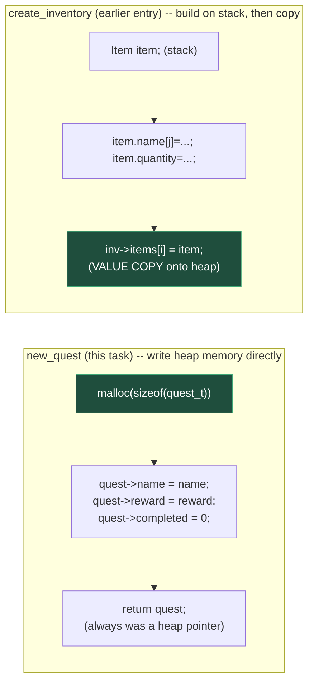

# Fix Quest Pointers

**Date:** 2026-10-05

**Language:** C

**Source:** boot.dev

**Concepts:** single heap allocation written to directly (no stack intermediate) · shallow pointer storage vs. deep string copy · consistent `NULL` guards across every function in an API · `const quest_t *` for a read-only accessor · "never return a pointer to stack memory"

---

## 🎯 The Problem

You're building a small quest system for a text-based RPG. Quests are stored on the **heap** and accessed through **pointers**. The job is to fix the pointer logic and memory allocation in three functions:

```c
typedef struct {
  const char* name;
  int reward;
  int completed; // 0 = not completed, 1 = completed
} quest_t;

quest_t* new_quest(const char* name, int reward);
void complete_quest(quest_t* quest);
int quest_reward_if_completed(const quest_t* quest);
```

### `new_quest(const char* name, int reward)`

Create a new quest on the heap and initialize it:

- Allocate memory for a single `quest_t` using `malloc`.
- Set `name` to the given `name` pointer, `reward` to the given `reward`, `completed` to `0`.
- If allocation fails (`malloc` returns `NULL`), return `NULL`.
- Otherwise, return a pointer to the new quest.

> Do **not** return the address of a local (stack) variable. The quest must live on the heap, so it stays valid after the function returns.

### `complete_quest(quest_t* quest)`

Mark a quest as completed:

- If `quest` is `NULL`, do nothing.
- Otherwise, set its `completed` field to `1`.

### `quest_reward_if_completed(const quest_t* quest)`

Return the quest's reward, but **only** if it is completed:

- If `quest` is `NULL`, return `0`.
- If the quest is completed (`completed` is `1`), return its `reward`.
- If the quest is **not** completed, return `0`.

### Examples

```c
quest_t* q = new_quest("Find the lost sword", 150);
// q->completed == 0

int r1 = quest_reward_if_completed(q);  // r1 == 0

complete_quest(q);

int r2 = quest_reward_if_completed(q);  // r2 == 150

free(q);
```

```c
quest_t* q = NULL;
complete_quest(q);                       // should be safe, no crash
int r = quest_reward_if_completed(q);    // r == 0
```

---

## 🧩 My Thought Process

**`new_quest` — allocate on the heap, then write every field directly into that allocation.**

```c
quest_t *quest = malloc(sizeof(quest_t));

if (quest == NULL) {
    return NULL;
}
quest->name = name;
quest->reward = reward;
quest->completed = 0;

return quest;
```

This is a more direct version of the "never return a pointer to stack memory" requirement than the approach I used in the earlier Fix Inventory Pointers exercise in this repo. There, I built an `Item` on the stack first and copied it *into* a heap array afterward. Here, there's no stack intermediate at all — `malloc` gives back a heap address immediately, and every field (`name`, `reward`, `completed`) gets written straight into that heap memory via `quest->field = value;`. There's simply no local `quest_t` variable anywhere in this function for a bug to accidentally return the address of. Both strategies satisfy the same rule; this one sidesteps the question entirely by never creating a stack copy in the first place.

I checked `malloc`'s result before touching `quest` at all — dereferencing a `NULL` pointer to write `quest->name = name;` would be undefined behaviour if the allocation had failed, so the `NULL` check has to come first.

**`quest->name = name;` stores the pointer itself, not a copy of the string — a deliberate difference from the earlier Fix Inventory Pointers exercise.**

`quest_t.name` is declared as `const char* name;`, not a fixed-size `char[32]` the way `Item.name` was in the inventory exercise. That difference in the struct's own definition is what determines the right behaviour here: there's no fixed buffer to copy into, so `quest->name = name;` simply stores the address the caller passed in. This means a `quest_t`'s `name` field is only valid for as long as whatever string the caller passed in stays valid — for a string literal like `"Find the amulet"` (as every test in this task uses), that's for the entire life of the program, so there's no actual risk in this exercise's test suite. But it's a genuinely different ownership model from the inventory task's deep copy, worth being explicit about rather than assuming "store a pointer" and "copy the data" are interchangeable choices.

**`complete_quest` and `quest_reward_if_completed` — the same `NULL` guard, applied consistently.**

```c
void complete_quest(quest_t* quest) {
  if (quest == NULL) {
    return;
  }
  quest->completed = 1;
}

int quest_reward_if_completed(const quest_t* quest) {
  if (quest == NULL) {
    return 0;
  }
  if (quest->completed) {
    return quest->reward;
  }
  return 0;
}
```

Both functions check `quest == NULL` before doing anything else, matching the spec's explicit requirement that passing `NULL` must be safe rather than crash. `quest_reward_if_completed` takes a `const quest_t*` specifically because it only *reads* the quest's fields — it never needs to modify anything, and marking the parameter `const` makes that read-only intent part of the function's own signature rather than something a reader has to infer from the body.

---

## ✅ My Solution

```c
#include <stdlib.h>
#include "quest.h"

quest_t* new_quest(const char* name, int reward) {
  quest_t *quest = malloc(sizeof(quest_t));

  if (quest == NULL) {
    return NULL;
  }
  quest->name = name;
  quest->reward = reward;
  quest->completed = 0;

  return quest;
}

void complete_quest(quest_t* quest) {
  if (quest == NULL) {
    return;
  }
  
  quest->completed = 1;
}

int quest_reward_if_completed(const quest_t* quest) {
  if (quest == NULL) {
    return 0;
  }

  if (quest->completed) {
    return quest->reward;
  }

  return 0;
}
```

---

## 🖼️ Visualizing: Direct Heap Write vs. Stack-Then-Copy



Both green steps are where each approach actually commits data to heap memory — `new_quest` never has anything *but* a heap pointer to work with, while `create_inventory` deliberately builds a value on the stack first and only commits it to the heap at the final assignment. Neither one ever returns or stores the address of a stack variable; they just reach that guarantee by two different routes.

### Shallow pointer vs. deep copy, for the `name` field specifically

```mermaid
flowchart LR
    caller["caller's string:\n\"Find the amulet\"\n(string literal, static storage)"]
    quest_name["quest->name\n(const char*)"] -->|"points directly to"| caller

    style quest_name fill:#4a3a1f,color:#fff,stroke:#c99a3f
```

`quest->name` is not a copy — it's the same address the caller's `name` argument held. This is safe here because every test passes a string literal, which exists for the entire program's lifetime. It would **not** be safe if a caller passed the address of a local buffer that later went out of scope — a scenario this task's own tests don't exercise, but worth knowing the API's actual guarantee (or lack of one) about string ownership.

---

## ✅ Verification — Plain C, No External Test Library

Following the standard established for C exercises in this repo, I reproduced all four cases from the pasted `munit`-based test file as a dependency-free plain-C file, using the `CHECK_INT`/`CHECK_STR`/`CHECK_PTR_NOT_NULL` macro pattern:

```c
#include <stdio.h>
#include <string.h>
#include <stdlib.h>
#include "quest.h"

static int tests_run = 0;
static int tests_passed = 0;

#define CHECK_INT(actual, expected, msg)        /* ... */
#define CHECK_PTR_NOT_NULL(actual, msg)         /* ... */
#define CHECK_STR(actual, expected, msg)        /* ... */

void test_basic_quest(void) {
    quest_t *q = new_quest("Find the amulet", 100);
    CHECK_PTR_NOT_NULL(q, "new_quest result");
    CHECK_STR(q->name, "Find the amulet", "q->name");
    CHECK_INT(q->reward, 100, "q->reward");
    CHECK_INT(q->completed, 0, "starts not completed");
    CHECK_INT(quest_reward_if_completed(q), 0, "uncompleted -- reward 0");
    complete_quest(q);
    CHECK_INT(q->completed, 1, "marked completed");
    CHECK_INT(quest_reward_if_completed(q), 100, "completed -- full reward");
    free(q);
}
/* ...three more test functions, same pattern, covering multiple
   independent quests, NULL-safety, and a three-quest happy path... */

int main(void) {
    test_basic_quest();
    test_multiple_quests();
    test_null_and_unfinished();
    test_big_happy_path();
    printf("\n%d/%d checks passed\n", tests_passed, tests_run);
    return (tests_passed == tests_run) ? 0 : 1;
}
```

Compiled and run two ways — a plain build, and a second build under **AddressSanitizer + UndefinedBehaviorSanitizer**, specifically to confirm every heap allocation this task creates is freed exactly once with no leak, and that `complete_quest(NULL)` / `quest_reward_if_completed(NULL)` never actually dereference a null pointer despite being called with one directly in the test suite:

```bash
gcc -std=c99 -Wall -Wextra -o verify_plain exercise.c verify_quest_pointers.c
./verify_plain

gcc -std=c99 -Wall -Wextra -fsanitize=address,undefined -g -o verify_asan exercise.c verify_quest_pointers.c
./verify_asan
```

**Result (both builds, identical, zero compiler warnings under `-Wall -Wextra`):**

```
Running checks for new_quest / complete_quest / quest_reward_if_completed

  test_basic_quest
  test_multiple_quests
  test_null_and_unfinished
  test_big_happy_path

21/21 checks passed
```

Both exit `0`. The ASan/UBSan build confirms all heap allocations across all four scenarios (including three simultaneously-alive quests in `test_big_happy_path`) are freed cleanly with no leak, and that passing `NULL` directly to `complete_quest` and `quest_reward_if_completed` — which the test suite does deliberately — never triggers an actual null-pointer dereference.

---

## 🔍 Portions Worth Refactoring

**1. `quest->name = name;` stores a pointer, not a copy — correct for this task, but worth flagging as a design decision rather than an oversight.**

Compared to the earlier Fix Inventory Pointers exercise, where `Item.name` was a fixed `char[32]` requiring an explicit bounded copy, `quest_t.name` is a `const char*` — the struct definition itself (not this function) is what decides whether a copy is needed. Given the struct as specified, storing the pointer directly is the only option available (there's no buffer to copy into), and it's entirely correct for this task's tests, which only ever pass string literals. If this API were extended to accept caller-owned, non-literal strings (say, a name built with `sprintf` into a local buffer), `new_quest` would need either a `strdup`-style deep copy or an explicit, documented contract that the caller must keep the string alive for as long as the quest exists. Not a bug here — just a note on what guarantee the current design does and doesn't make.

**2. No performance concern.**

All three functions are O(1) — a single allocation, a single field write, a single field read. There's no loop, no array, nothing to make sub-optimal here.

**3. The three `NULL` guards are consistent with each other — worth noting as a positive, given an earlier entry in this repo had a gap here.**

`new_quest` checks `malloc`'s result, `complete_quest` checks its `quest` parameter, and `quest_reward_if_completed` checks its `quest` parameter — all three treat an invalid/failed pointer the same way (do nothing / return a zero-equivalent value) rather than crashing. This is worth calling out specifically because the earlier Fix Inventory Pointers exercise had a real inconsistency here (one failure path forgot to reset an output parameter that another path did reset) — this solution doesn't repeat that pattern.

---

## 💡 The Core Lesson

**"Never return a pointer to stack memory" has more than one correct way to satisfy it — writing directly into heap memory from the start (as `new_quest` does here) and building a value on the stack before copying it onto the heap (as the earlier Fix Inventory Pointers exercise did) are both valid strategies, and the right one depends on whether there's a reason to assemble the value somewhere else first.**

`new_quest` has no such reason: every field it needs (`name`, `reward`, a constant `0` for `completed`) is available immediately, so there's nothing gained by staging them in a local variable before writing them into the heap allocation. The inventory exercise's `Item` did have a reason — building the bounded-copy name character-by-character read more naturally as "assemble the value, then commit it" — but that was a readability choice about *that* function's specific copying logic, not a requirement of the stack-memory rule itself. Both are correct C; recognizing that there's a choice here, rather than one "right" pattern, makes it easier to pick the simpler option when nothing forces the more elaborate one.

---

## 📚 Lessons Learnt

**1. A heap allocation can be written to directly, field by field, with no local struct variable at any point.**
`quest->name = name; quest->reward = reward; quest->completed = 0;` all write straight into the memory `malloc` just returned — there's no stack copy to accidentally return the address of, because none was ever created.

**2. Whether a struct field should store a pointer or a deep copy is decided by the struct's own field type, not by the function writing to it.**
`const char* name` only has room to hold an address; a fixed `char name[32]` only has room to hold actual characters. The struct definition, set before `new_quest` is ever written, already answers "copy or reference?" for this particular field.

**3. Checking `malloc`'s result before writing through the returned pointer is not optional defensive style — it's required correctness.**
Writing `quest->name = name;` before confirming `quest != NULL` would dereference a null pointer the moment allocation failed, which is undefined behaviour, not merely "probably fine."

**4. `const quest_t*` on a read-only accessor documents intent in the function's own signature.**
`quest_reward_if_completed` never needs to modify the quest it's given, and declaring its parameter `const` makes that guarantee checkable by the compiler rather than just implied by the function's behaviour.

**5. Consistent `NULL` handling across every function in a small API is worth verifying explicitly, not assuming.**
All three functions here treat an invalid pointer identically (safe no-op / zero-equivalent return) — confirmed directly by running `complete_quest(NULL)` followed by `quest_reward_if_completed(NULL)` back to back in the verification suite, the same scenario the original test file itself exercises.

**6. "Never return a pointer to stack memory" doesn't dictate a single implementation pattern — it dictates an outcome, and there's more than one way to reach it.**
Writing straight into a fresh heap allocation and building-then-copying onto the heap are both valid; picking between them is about what's clearest for a given function's logic, not about which one is "the" correct way to satisfy the rule.

**7. An ownership assumption that holds for every test case in a suite isn't necessarily a guarantee the API makes in general.**
`quest->name = name;` works correctly for every test here because they all pass string literals — but that's a property of the *tests*, not a property the function itself enforces or documents. Recognizing the difference is what separates "this passes" from "this is safe for every way the function could reasonably be called."

---

## 🔗 Further Reading

- [cppreference — `malloc`](https://en.cppreference.com/w/c/memory/malloc)
- [cppreference — `const`-qualified pointers](https://en.cppreference.com/w/c/language/const) (see the distinction between a pointer to `const` data vs. a `const` pointer)
- [cppreference — `strdup`](https://en.cppreference.com/w/c/experimental/dynamic/strdup) — the standard way to deep-copy a string onto the heap, relevant if `new_quest`'s `name` ownership model ever needed to change
- [AddressSanitizer (Google/LLVM)](https://github.com/google/sanitizers/wiki/AddressSanitizer)
- Next to explore: add a `free_quest(quest_t *quest)` function to the API (rather than relying on every caller to call `free(q)` directly, as the tests currently do), and consider whether `new_quest` should `strdup` its `name` argument if `free_quest` is ever expected to also free the name string it points to.